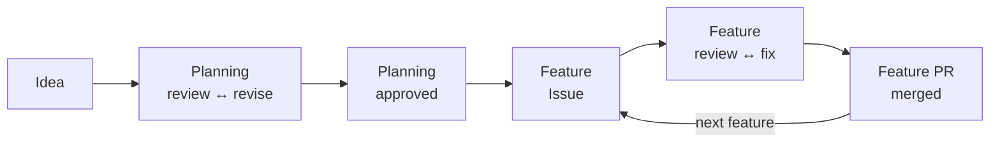

# Agentic Coding Template

A lightweight, model-agnostic repository template for agentic software engineering. It applies the useful parts of GH-600 at individual/small-team scale: plan → act → evaluate, GitHub as control plane, isolated execution, explicit agent contracts, risk-based autonomy, evidence, independent review, CI, and human gates for high-risk actions.

## How it works

A project goes from an idea to merged features in two phases, each with an
independent, read-only review loop and explicit human approvals.



- [Workflow](docs/workflow.md): the workflow in flow, artifact, and reference views.
- [Worked example](docs/example.md): a complete run with a sample project.
- [Development](docs/development.md): every command and its options.
- [Project map](docs/project-map.md): what each file in the template is for.

## Start a new project

1. Create a repository from this template, complete `docs/repository-setup.md`,
   and check your machine with `./scripts/doctor.sh`.
2. Set the provider and model of each role in `.agents/agents.conf`.
3. Plan the project in a planning worktree:

   ```bash
   ./scripts/start-planning.sh --description path/to/idea.md
   cd ../<repository>-planning-project-bootstrap
   ./scripts/review-planning.sh
   ./scripts/revise-planning.sh --review .agents/reviews/planning-project-bootstrap-review-01.json
   ./scripts/review-planning.sh    # again after each revision, until it passes
   ./scripts/finish-planning.sh
   ```

   Commit, push, and merge the planning PR as `finish-planning.sh` shows, then
   remove the planning worktree with
   `./scripts/cleanup-worktree.sh planning/project-bootstrap`.
4. For each roadmap feature, from the primary checkout and then the feature
   worktree:

   ```bash
   ./scripts/create-feature-issue.sh F01
   ./scripts/start-feature.sh 12 recipes
   cd ../<repository>-12-recipes
   ./scripts/review-feature.sh 12
   ./scripts/triage-review.sh .agents/reviews/feature-12-recipes-review-01.json
   ./scripts/apply-triage.sh .agents/triage/feature-12-recipes-review-01-triage.json
   ./scripts/review-feature.sh 12    # again after fixes, until it is resolved
   ./scripts/finish-feature.sh 12 "Add recipes"
   ```

   Push, open a PR containing `Closes #12`, merge it after CI, and remove the
   worktree from the primary checkout with
   `./scripts/cleanup-worktree.sh 12`, or all merged worktrees at once with
   `./scripts/cleanup-worktree.sh --merged`.

Rules for agents are in `AGENTS.md`; boundaries are in `.agents/policies/`.
