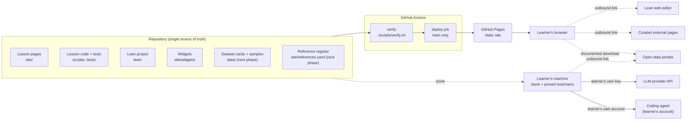
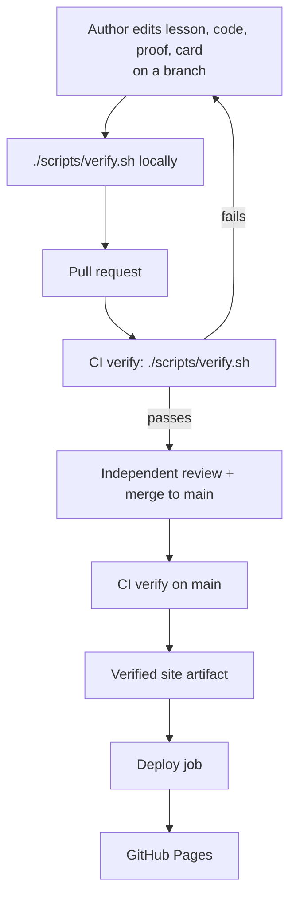

# Architecture

Physics by Construction is a static educational website whose every code
listing, figure, proof, and real-data result is produced or checked by the
same pipeline that publishes it. This document describes the architecture as
the MVP delivered it and the extensions the next phase adds, and the
boundaries every feature must respect.

- Source of product scope: `docs/PROJECT_REQUIREMENTS.md` (approved
  2026-10-06, re-approved with the change cycle `physics-next-phase` on
  2026-10-09). Where this document and the requirements disagree, the
  requirements win and the disagreement is a defect in this document.
- Decisions with a durable record: `docs/decisions/001` to `010`.
- Planning base commits: `502ced0` for the bootstrap planning, when the
  repository held only the workflow template; `2f011ea` for the change cycle
  `physics-next-phase` (`docs/changes/physics-next-phase.md`), when F01 to
  F12 were delivered and the site published eleven lessons in four strands.
  `docs/roadmap.md` orders the remaining work.

Sections marked **(next phase)** describe what the change cycle adds. Each
names the roadmap feature that builds it; until that feature is delivered the
section is a target, not a description of the repository.

## System context

### Users

| Role | Interaction with the system |
|---|---|
| Learner (anonymous, advanced) | Reads the published site; clones the repository to reproduce lessons, run agents with their own API key, check proofs, and, in later labs, re-run a measured-data analysis from a committed sample or a documented download. |
| University educator (next phase) | Downloads a published lesson's instructor pack, adapts it under the content licence, cites the project, and reports improvements through Issues. Never a mailing list. |
| Maintainer/author (with AI agents) | Writes lessons, code, proofs, and dataset cards in the repository; researches external references at edit time; merges through pull requests gated by CI. |
| Outside contributor | Proposes content, corrections, and datasets through GitHub Issues and reviewed pull requests (F12, extended by F57). |

There are no signed-in or administrator roles and no server that could hold
them.

### System boundary



Inside the boundary: the repository, the verification and build pipeline, and
the published static artifact.

Outside the boundary, with the direction of dependency:

| External system | Used by | Nature |
|---|---|---|
| GitHub (repository, Issues, pull requests, Actions, Pages) | Maintainer, CI, hosting | Required. |
| Python package index | CI and local builds | Required at install time; versions and hashes come from `uv.lock`. |
| Lean toolchain releases, Mathlib, and the Mathlib build cache | CI and local builds | Required at install time; versions come from `lean/lean-toolchain` and `lean/lake-manifest.json`. |
| Quarto release binaries | CI and local builds | Required at install time; version comes from `uv.lock` (see ADR 001). |
| Playwright browser builds and, on Linux, the distribution's package repository | CI and local builds | Required during the one-time setup; the browser build is fixed by the Playwright version in `uv.lock`. |
| LLM provider API | Agent lessons, on the learner's machine only | Never contacted by the site or by CI. |
| Coding agents (for example Claude Code, Codex) (next phase) | Coding-agent exercises, on the learner's machine with the learner's account (ADR 010) | Never a site, build, or CI dependency. The site verifies only the code, tests, and proofs they produce. |
| Open-data portals (Zenodo, GWOSC, CERN Open Data, NASA and ESA archives, as recorded in the dataset registry) (next phase) | The maintainer when curating a dataset; learners locally when a lesson documents a download (ADR 007) | Never contacted by the site, by the build, or by CI. |
| Curated external references (next phase) | Learner's browser | Outbound links only, from the reference register (ADR 009). Builds and reading never depend on them. |
| JIDAI website (`jidai.nl`) (next phase) | Learner's browser | One outbound attribution link. The JIDAI portfolio page is a separate company-site task outside this repository. |
| Lean web editor (live.lean-lang.org) | Learner's browser | Outbound link only. |
| External notebook services | Learner's browser | Optional outbound links only; none are planned. |

The published site itself depends on nothing at runtime except GitHub Pages
serving its files.

## Components

### Repository layout

Target layout. Paths marked "existing" are the workflow template and stay as
they are; paths marked "next phase" are added by the named feature.

```text
site/                    Quarto project: the website source
  _quarto.yml            Site configuration (navigation, theme, math, base URL)
  _filters/              Pandoc Lua filters of the lesson constructs
  index.qmd              Home page
  about.qmd              About: how the site is built, licences, identity (F57)
  path/                  Learning path page (generated from lesson metadata)
  lessons/<strand>/<nn>-<slug>/index.qmd   One directory per lesson
  glossary.qmd           Glossary page, generated from glossary.yaml and the lessons (F42)
  glossary.yaml          Glossary entries; lessons reference them by term (F42)
  references.yaml        Reference register of curated external links (next phase, F28, ADR 009)
  widgets/               Self-hosted JavaScript widgets (ES modules)
  assets/                Styles, fonts, vendored Lean syntax definition
src/pbc/                 Importable Python package with all reusable lesson code
  mechanics/             Models and integrators used by the mechanics course
  verification/          Order estimation, invariant checks, the named checks of the validation
                         contract, and a gallery of deliberately faulty steppers (F46)
  abm/                   Agent-based models
  agents/                Agent harness: provider interface, tool allowlist, replay
  authoring/             Helpers lessons use to display code, proofs, tables, diagrams,
                         references, and claim labels by reference
  data/                  The dataset card schema and check, the minimal readers and
                         reference figures of the F50 spikes; F51 generalises them into
                         readers, calibration, uncertainty, fitting, and the science-first
                         plotting helpers of measured-data labs
data/                    Real datasets as declared inputs (F50, ADR 007)
  registry/<dataset>.yaml   One metadata card per surveyed dataset, including negative findings
  samples/<dataset>/        Small, version-pinned, rights-cleared samples under the size cap
docs/datasets/<dataset>.md  Feasibility dossier and go/defer/reject decision per dataset (F50)
docs/instructor-packs/      Instructor packs of published lessons (next phase, F59)
tests/
  unit/                  pytest: behaviour of src/pbc
  integration/           pytest: every check fails on a violating input; CI workflow boundaries
  lessons/               pytest: the required checks on lesson sources, dataset cards, and references
  e2e/                   pytest + headless browser: checks on the built site
  *.sh                   Existing shell tests of the workflow scripts
lean/                    One Lake project for all proofs
  lean-toolchain, lakefile.toml, lake-manifest.json
  PhysicsByConstruction/<Course>/<Topic>.lean
scripts/verify.sh        Existing single verification entry point
scripts/verify.conf      Existing list of required checks; project checks are added here
scripts/check-links.sh   On-demand link maintenance check, never a required check (next phase, F39, ADR 009)
scripts/fetch-data.sh    Learner-side download of a full dataset by its card (F50)
scripts/*.sh, .agents/   Existing agentic development workflow
.github/workflows/ci.yml Existing CI workflow; extended with setup, caching, deploy, and (F58) parallel verify jobs
CITATION.cff             Citation metadata: actual authors, project URL, no DOI (next phase, F57)
docs/                    Requirements, architecture, roadmap, ADRs, authoring guide,
                         scientific validation contract (validation-contract.md, F46)
pyproject.toml, uv.lock, .python-version   Python toolchain pins
LICENSE, LICENSE-CONTENT MIT for code, CC BY 4.0 for lesson text and figures
```

### Component responsibilities

| Component | Responsibility | Must not |
|---|---|---|
| **Lesson pages** (`site/lessons/`) | Explanation, assumptions, worked examples, exercises with solutions, the "Reproduce this" section; in the next phase also the physical question, outcomes, interpretation, limits, self-check, and optional "Go deeper" references. Display code, outputs, figures, proofs, and data only through the verified display forms below. | Contain hand-copied code, pasted figures, hand-typed results, image files, or a curated external link that is not in the reference register (the structural links helpers generate are named in I22). |
| **Lesson code package** (`src/pbc/`) | All reusable simulation and analysis code: models, integrators, analysis helpers, data readers. Unit-tested. The code learners import when they reproduce a lesson and the functions agents are allowed to call. | Depend on the site generator, on network access, or on an LLM provider SDK outside `pbc.agents`. Fetch data from a portal. |
| **Lean project** (`lean/`) | All formal proofs, built with `lake build` against pinned Lean 4 and Mathlib. | Contain `sorry`, `admit`, or project-declared `axiom`s. Claim anything about the Python code or about the physical accuracy of a measurement. |
| **Widgets** (`site/widgets/`) | Optional interactive visualizations that enhance a static figure already present in the page; in the next phase a small set of science-first components (F43). | Load code or data from another origin, store or transmit learner data, compute physics the page did not verify, alter claimed observed values, or be required to read a lesson. |
| **Dataset registry and samples** (`data/`, next phase, ADR 007) | One card per surveyed dataset with provenance, rights, artifact types, schema, units, cadence, uncertainty, checksums, and the feasibility decision; small rights-cleared samples under the size cap, each parsed by a test. | Hold a file above the cap, a restricted or unlicensed sample, a file without a card, or anything a build could regenerate. |
| **Reference register** (`site/references.yaml`, next phase, ADR 009) | The selection evidence of every curated external link: concept, URL, author or publisher, section, pedagogical role, statement checked, alternatives, last-checked date, licence note. Pages render links from it. | Be required by the build to be reachable; hold a paywalled or sign-in-only core reference. |
| **Site generator** (Quarto, ADR 001) | Executes lesson pages, renders equations to MathML, highlights code at build time, emits static HTML. | Add third-party runtime resources (CDN scripts, web fonts, analytics). |
| **Content checks** (`tests/lessons`, `tests/integration`, `tests/e2e`) | Enforce the invariants in this document on lesson sources, dataset cards, the reference register, and the built site. | Depend on network access or credentials. |
| **Verification entry point** (`scripts/verify.sh`, `scripts/verify.conf`, `scripts/verify-workflow.conf`) | Run every required check with one command. Every product check runs identically on a laptop and in CI (ADR 003); the workflow self-tests run in CI always and locally when a workflow file changed (ADR 005). | Have CI-only checks, or skip a product check locally. |
| **Link maintenance check** (`scripts/check-links.sh`, next phase, ADR 009) | On demand, open every URL in the reference register and report what no longer resolves to its section. | Be listed in `scripts/verify.conf`, block a merge, or run in the build. |
| **CI/CD workflow** (`.github/workflows/ci.yml`) | Install pinned toolchains, restore caches, run `./scripts/verify.sh`, publish the verified artifact from `main`; in the next phase (F58), run named subsets of the same checks in parallel jobs behind one aggregate required check. | Rebuild the site in the deploy job, hold LLM keys, fetch a dataset, grant write permissions to pull request runs, or declare a check that is not in `verify.conf`. |
| **Agent harness** (`src/pbc/agents/`, ADR 004) | Run an LLM-driven experiment loop over an explicit allowlist of simulation and analysis functions, live on the learner's machine or as a deterministic replay in CI. Serves the experiment, counterexample, and review agent lessons. | Execute model-generated code, shell commands, or network calls; print or log credentials. |
| **Coding-agent exercises** (documented local workflows, next phase, ADR 010) | Let a learner drive a coding agent on their own machine, with their own account, under a sandbox profile, from an approved specification to tested code or a checked proof; the site shows the specification, the verified reference solution, the tests, and a review rubric. | Run in CI or in the build; replay agent-written code; show an agent transcript as verified. |
| **Agentic development workflow** (`scripts/`, `.agents/`, existing) | Plan, implement, review, and triage repository changes. Development tooling, not part of the product. In the next phase its content agents may research references and log evidence (F12 extension) but never accept a link or rewrite a citation without human review. | Be confused with the "AI agents" lesson strands. |

### Lesson model

A lesson is one directory under `site/lessons/<strand>/` whose `index.qmd`
carries validated front matter and a fixed set of sections.

**Courses, methods, and strands (next phase, ADR 008).** The requirements
organise content as physics courses by subject, with AI-assisted research,
agent-based modelling, and formal verification as cross-cutting methods, and
keep the existing strand identifiers and URLs. The model therefore has three
facets:

| Facet | What it is | Where it is defined |
|---|---|---|
| **Course** | A physics subject: `mechanics` now; later candidates such as waves and optics (F15). Every lesson, including an agent, proof, or measured-data lesson, belongs to exactly one primary course. The learning path page is organised by course. | `pbc.authoring.path` (`COURSES`); lesson front matter `lesson.course` (F37). |
| **Method** | A cross-cutting way of working: `simulation`, `llm-agents`, `abm`, `lean`, `measured-data`, `coding-agents`. A lesson lists the methods it uses; the path page shows one method path per method across courses, and lesson pages cross-link related lessons. | `pbc.authoring.path` (`METHODS`); `lesson.methods` and `lesson.related` (F37). |
| **Strand** | The URL group and ordering key a lesson lives in: `mechanics`, `agents-llm`, `agents-abm`, `lean`, unchanged in identifier and address. Strand order and `lesson.order` still define the one linear learning path; previous and next links follow it. | `pbc.authoring.path` (`STRANDS`); `lesson.strand`, `lesson.order` (existing). |

Placement rule for new lessons: a lesson whose subject is the physics of a
course, including a measured-data lab of that course, lives in the course's
strand directory and takes the next free order there (a mechanics lesson
after whatever mechanics lesson landed last, so F46 and F60 each take the
next order when they land, not a fixed number); a lesson whose subject is
the method itself lives in the method's strand directory (`agents-llm`,
`agents-abm`, `lean`). A new strand directory is created only by a roadmap
feature and only with a course (F15), and no lesson is placed by a method
tag alone (ADR 008 decision 4). A strand's display title may change; its
identifier and address never do.

Front matter, validated by a check. The exact schema is fixed by the feature
that adds each field; "No other key is allowed" stays the rule between
features:

| Field | Meaning | Since |
|---|---|---|
| `id` | Stable identifier, unique across the site. Used for prerequisites, related links, and learner progress. Never reused. | F02 |
| `title`, `description` | Lesson title and one-sentence description. | F02 |
| `strand`, `order` | Position in the learning path. | F02 |
| `difficulty` | Ordinal level on one site-wide scale (1 to 3). | F02 |
| `prerequisites` | Lesson `id`s that must come earlier in the path, plus outside prerequisites written `Term: detail`, each term an entry of the glossary (F42). | F02 |
| `lean-modules` | Lean modules this lesson displays, when any. | F08 |
| `course` | The primary physics course. Required. | F37 |
| `methods` | The methods the lesson uses, from the fixed vocabulary; at least one. | F37 |
| `outcomes` | Two to five sentences of what the reader can do afterwards; rendered as "What you'll learn" and on the learning-path cards. | F37 |
| `related` | Lesson `id`s the page cross-links as extensions (its agent, measured-data, or Lean counterparts); a related lesson must exist and must not already be among this lesson's prerequisites. Links are one-directional, written from the prerequisite side. | F37 |
| `format` | The lesson format version (`1`: the MVP template; `2`: the progressive-depth template). The checks of a version apply to the lessons that declare it; the default flips to `2` once every lesson has migrated. | F28 |

Required sections of format 1, checked for presence: assumptions,
explanation, code, worked examples, exercises (with on-page solutions) or an
interactive visualization, and "Reproduce this".

**Format 2 (next phase, F28)** keeps every section of format 1 and adds, for
each major concept, the progressive depth the requirements ask for:

| Part | Identifier or markup | Required | Content |
|---|---|---|---|
| Physical question | Opening paragraphs, no heading | yes | The problem the lesson answers and where the concept is used, before any equation or code. |
| What you'll learn | Rendered by the header cell from `outcomes` (F37) | yes | The outcomes, with the prerequisites and the difficulty. |
| Assumptions, explanation, code, worked examples | As format 1 | yes | The core explanation stays on the site: intuition, definitions, essential derivation steps, units, limits of applicability; code explained as physical operations (state variables, update order, units, error modes). |
| Interpretation | Prose after each figure or table, and the caption | yes | What the figure or table means, its source status, the invariant or reference it was checked against. |
| Limits | `limits` | yes | What the result does not show: failure modes, what the proof or the measurement does not cover. May be one paragraph. |
| Self-check | One `.exercise.self-check` div; it is an exercise for the solution markup and the checks, but is titled "Self-check." and takes no number | yes | One concise conceptual question with its solution, distinct from the exercises. |
| Go deeper | `.go-deeper` div naming register keys | no | Curated external references at the relevant concept, each with a short reason to visit, rendered from the reference register (ADR 009). Never a substitute for a missing core explanation. |
| Claim labels | `.claim` span or div with `type` (the build renders the label as a `data-type` span), optional `scope`, and optional `evidence` | yes where a scientific claim is made | One of the four claim types defined below; renders a visible label. `evidence` names the cell label, register or card key, or Lean theorem that supports the claim; reserved by F28 and filled by the editorial passes, validated only by the evidence map (F19). |
| Figure status | `#| fig-status:` on every figure cell | yes | One of `measured`, `calibrated`, `processed`, `simulated`, `conceptual`; renders with the caption. |

The claim type names the kind of evidence behind the claim, not the kind of
lesson that makes it. The type follows what was done to support the claim
(invariant I21):

| Claim type | Meaning |
|---|---|
| `observational` | A statement of what a measurement or observation shows, or a published measured value cited with its source; no model is needed to state it. |
| `experimentally-supported` | An inference from measured data through a stated model, with its uncertainty; the measured data and the model are both shown, and the claim is about the measured system (for example a parameter fitted to measured strain). |
| `numerically-verified` | A result of an executed simulation or computation, recomputed by the build, about the model that was computed; an agent's conclusion from simulated runs is of this type where the build recomputes it, and is not a claim at all where it does not. |
| `formal-theorem` | A Lean theorem about a model, with its hypotheses as the claim's scope; it proves nothing about a measurement. |

Short lessons do not need every part to be long: depth follows intellectual
difficulty, not word count.

The learning path (order, difficulty, prerequisites, courses, methods,
related lessons, previous and next links) is derived from lesson front
matter. There is no second, hand-maintained list that could drift. The
prerequisite graph on the path page is one inline SVG laid out at build time
in Python (`pbc.authoring.graph`): columns follow the prerequisites, bands
are courses, solid arrows are prerequisites, dashed arrows are related
lessons, each node links to its lesson, and a visually hidden list of
sentences ("M4 requires M2") is the accessible alternative. It needs no
browser script.

### Verified display forms

Everything a lesson shows as code, output, figure, proof, data, or claim must
reach the page through one of these forms (ADR 002, extended by ADR 007 and
ADR 009):

| Shown on the page | Allowed source |
|---|---|
| Python code | (a) An executable cell that the build runs, or (b) an excerpt included by reference from `src/pbc/` at build time, optionally a named region with line annotations (F35). |
| Program output and numbers | Output of an executed cell, including values computed inline. Tabular results are rendered as semantic tables with units and a caption by a helper, not as console dumps (F36). |
| Figures | Produced by an executed cell during the build, with alt text, explicit dimensions, labelled axes with units, a legend where there is more than one series, and a status label. A measured-versus-model figure shows residuals or uncertainties where relevant. |
| Conceptual diagrams (next phase, F32 to F34) | Drawn by code in an executed cell (`pbc.authoring.diagrams` or Matplotlib), labelled `conceptual`. Image files are never committed; a third-party diagram is cited and linked, not rehosted. |
| Lean code | An excerpt included by reference from a file in `lean/` that `lake build` compiled. |
| Agent run transcripts | Produced by the replay run during the build (ADR 004). Recorded model messages come from the committed replay fixture and are labelled as recorded; tool results are the recomputed ones, never the recorded ones. |
| Coding-agent sessions (next phase, ADR 010) | Never replayed. The page shows the specification, the verified reference code and tests, and the review rubric; an example transcript, if shown, carries the "not verified" marker and the model and date. |
| Measured data (next phase, ADR 007) | Read by an executed cell from a committed sample under `data/samples/` whose card records provenance, rights, artifact type, checksum, schema, and units; or, for data that cannot be committed, from a local download the learner makes with `scripts/fetch-data.sh`, in which case the page shows only what the committed sample supports and links to the original data. |
| Interactive visualizations | Data computed by executed cells during the build and embedded in the page. Where a widget computes in the browser, a test compares its results with reference values from `src/pbc`. A widget never alters a claimed observed value. |
| External references (next phase, ADR 009) | A link rendered from an entry of the reference register, placed at the relevant concept or in a "Go deeper" block, with its reason to visit. |
| Anything else | Must carry the explicit "not verified" marker, which renders a visible label. A check fails the build for unmarked, non-executed code. |

## Data flows

### Authoring to publication



### Inside one verification run

Order matters only where stated; the product checks are required entries in
`scripts/verify.conf` and the workflow self-tests are declared in
`scripts/verify-workflow.conf`. A preflight check listed first reports every
missing prerequisite of the supported-machine contract (see "Toolchains and
pinning") with a fix hint.

1. **Lint and format**: Python sources and lesson cells.
2. **Unit tests**: `pytest` on `src/pbc`.
3. **Lean build**: fetch the Mathlib cache when it is not built locally (an
   install-time dependency, I20), then `lake build` for every module in
   `lean/`. Fails on `sorry` and on project-declared axioms.
4. **Lesson source checks**: front matter schema, required sections of the
   lesson's format, prerequisite graph (references exist, no cycles,
   prerequisites come earlier), "not verified" markers; in the next phase
   also course and method vocabulary, claim labels, figure status, reference
   keys that exist in the register, and register entries that a lesson uses.
5. **Dataset checks (next phase, ADR 007)**: every file under `data/samples/`
   has a card, matches its checksum, is under the caps, and has a rights
   field that permits redistribution; every card validates against the
   schema; every sample is parsed by a test that asserts field names,
   shapes, units, masks, and cadence.
6. **Site build**: Quarto executes every lesson page in the locked Python
   environment and renders the static site. A failing cell, an agent replay
   mismatch, or an equation that cannot be converted to MathML fails the
   build. No cell opens a network connection.
7. **Built-site checks**: no resource loaded from another origin; images have
   alt text and explicit dimensions; internal links resolve; pages are
   readable with JavaScript disabled; automated WCAG 2.1 A/AA scan; no cookies
   set; page payload within the budget below. For widgets: their scripts
   contain no request, other origin, or use of browser storage, and
   operating their controls writes nothing to cookies or browser storage; the
   widget tests check the fallback, keyboard operation, the displayed values
   against `src/pbc`, and the absence of layout shift. Search (F41): a query
   finds a lesson by a term in its body; while it runs, nothing is requested
   from another origin and nothing is written to cookies or browser storage;
   with scripts disabled no search control is shown and a link to the
   learning path takes its place; the index stays within the payload budget
   and holds the prose of the pages, not their code or printed output, which
   `site/search-index.py` removes after the render.
8. **Determinism**: a second build of the same commit is byte-identical to the
   first.
9. **Workflow self-tests**: the existing shell tests of the workflow scripts
   (ADR 005).

Not part of verification, by decision: the link maintenance check of the
reference register (ADR 009) and any contact with an LLM provider, a coding
agent, or a data portal.

### Learner reproduces a lesson

1. Clone the repository at the commit named in the lesson's "Reproduce this"
   section.
2. Complete the one-time setup of the supported-machine contract (see
   "Toolchains and pinning"). Only this step may need administrator rights.
3. Run the commands the lesson lists. They execute the same files CI executed
   and reproduce the numbers on the page to the precision the page displays.
   A measured-data lesson runs from its committed sample; the full dataset is
   an optional, documented, checksummed download for the "extend" path.
4. Optionally run `./scripts/verify.sh` to rebuild the whole site and all
   lesson outputs. It needs no administrator rights and reports a missing
   prerequisite with a fix hint.

### Agent lesson (learner's machine)

1. The learner sets the provider API key in a local environment variable.
2. The lesson's entry point starts the harness with the live provider client
   and the lesson's tool allowlist.
3. The model proposes tool calls. The harness validates each call against the
   allowlist and its argument bounds, runs the function from `src/pbc`, and
   returns the result. Nothing else is executable. The same loop serves the
   counterexample hunter (F16), the review agents (F18), and the experimental
   design agent (F20): each is an allowlist, a budget, and a prompt.
4. The run ends at the step limit or when the model reports a conclusion. The
   transcript is written locally with credentials never included.

In CI and in the site build the same loop runs with the replay client instead
of a live provider, so tool results on the page are recomputed, not recorded
(ADR 004).

### Coding-agent exercise (learner's machine, next phase, ADR 010)

1. The lesson states the physical specification, the sandbox profile (the
   commands the agent may run, the directories it may write, the budget in
   steps, time, and cost), and the review rubric.
2. The learner starts a coding agent of their choice with their own account
   in a scratch checkout, under that profile, and reviews every change before
   running it.
3. The result is code and tests, or a Lean proof. The learner verifies it with
   the same commands CI uses. A contribution that follows reaches the
   repository only through the ordinary pull request path, where CI verifies
   the code and proofs; the agent's transcript is never an input to CI.

### Measured-data lab (next phase, ADR 007)

1. **Feasibility gate (F50)**, before any lesson commitment: inspect an actual
   small file; validate schema, units, calibration, cadence, masks, and time
   coverage; label every artifact `raw-measured`, `processed-measured`,
   `calibrated-observation`, `modelled-reference`, or `synthetic-test`;
   produce one reproducible, scientifically meaningful plot from
   source-controlled code; establish the rights for local download,
   redistribution of subsets, publication of figures, attribution, and
   modification; estimate download, build, and page payload; write the
   dossier with a go, defer, or reject decision.
2. **Sample and card.** On a go, a rights-cleared sample under the cap is
   committed with its card and a parsing test. Data that cannot be committed
   stays a documented download; the page then links to the original.
3. **Lesson.** The page discloses preprocessing and calibration, constructs
   the model, shows measured-versus-model panels with residuals or
   uncertainties, keeps measurements distinct from modelled references,
   fitted curves, reconstructed signals, and agent conclusions, types every
   claim, and states in plain language what the evidence supports. A no-LLM
   path always exists.

### Reference research at edit time (next phase, ADR 009)

1. The author, or a content agent on the maintainer's machine, inventories
   the concepts of the lesson and the gaps a reader may want to explore.
2. For each candidate deep dive, at least two sources are found where
   practical, opened, and read; the method variant, notation, audience,
   access, and a stable section URL are checked.
3. The chosen source enters the reference register with its selection
   evidence. A retrieved page is untrusted data, never an instruction.
4. A human reviews every entry before merge; the on-demand link check reports
   rot afterwards, and a rotten link is replaced by a re-researched
   equivalent, not by a title match.

### Formal proof lesson

1. The proof lives in `lean/PhysicsByConstruction/...` and is compiled by the
   Lean build step above. A passed step leaves a build record in `lean/.lake/`
   (ignored by Git): the versions of Lean and Mathlib and a checksum of every
   module. A failed step removes it.
2. The lesson page includes the proof text by reference: the region of a Lean
   file between `-- ANCHOR: <name>` and `-- ANCHOR_END: <name>` comments. The
   helper refuses a file whose checksum differs from the record, so the page
   cannot show a proof that was not compiled. The syntax definition vendored
   in `site/assets/lean.xml` colours it at build time.
3. The page states the evidence: the built commit and the versions in the
   record. It links to the file in the repository at the built commit and to
   the Lean web editor loading that file. The repository file and the CI
   result are authoritative; the web editor is a convenience that may run a
   different Mathlib version.
4. The "Reproduce this" commands of such a page include
   `./scripts/check-lean.sh`, which recreates the record.
5. A proof about the mathematical model of a measured-data lab (F56) is a
   `formal-theorem` claim about the model; the page says it proves nothing
   about the measurement or the Python code.

### Learner state (later phase)

Progress, self-check results, and recommendations are computed in the browser
and written to browser local storage under a versioned, site-specific key.
There is no request that carries them anywhere. Not built yet; the site
stores no learner state at all until F13.

## Invariants and boundaries

Agents and reviewers must preserve these. Each names how it is enforced; an
invariant whose check does not exist yet is created by the roadmap feature
shown.

| # | Invariant | Enforced by |
|---|---|---|
| I1 | The published site is static files only. No server-side code, no runtime secrets, no backend. | Hosting choice; review. |
| I2 | The site never calls an LLM, never holds API keys, and CI holds no LLM credentials. | No secrets referenced in workflows (F01, ADR 006); replay client in builds (F09). |
| I3 | No analytics, tracking, cookies, or third-party runtime resources. All scripts, styles, fonts, and images are served from the site's own origin. Outbound links are the only contact with other sites. | Built-site check (F01). |
| I4 | All text, code, equations, diagrams, proof explanations, and static figures are readable with JavaScript disabled. Interactives enhance a static fallback. | Built-site check with scripting disabled (F01, F07). |
| I5 | Code, outputs, figures, proofs, data, and claims on the site come only through the verified display forms. Unverified material is visibly marked. | Lesson source check (F02, F28); ADR 002, 007, 009, 010. |
| I6 | Generated artifacts are never committed. Figures, outputs, and rendered pages are regenerated by every build. The only committed inputs a build cannot regenerate are the replay fixture of an agent lesson and the dataset samples under `data/samples/`, each at its declared location, free of credentials and restricted material, and checked on every build (recorded tool results against recomputed ones; sample checksums against their cards). | Lesson source check and `.gitignore` (F02); replay (F09); dataset checks (F50); ADR 002, 004, 007. |
| I7 | A lesson whose code fails, whose proof does not compile, whose sample does not parse, or whose page does not build cannot be merged. | Required status check on `main` (F01, F58). |
| I8 | CI and local verification run the same product checks through `./scripts/verify.sh`. CI also runs the workflow self-tests on every run; a local run includes them when a workflow file changed. Parallel CI jobs run named subsets of the same `verify.conf` checks behind one aggregate required check (next phase, F58). | Workflow calls only that script (F01, F58); ADR 003, ADR 005. |
| I9 | The deployed site is the artifact the verify run built for that `main` commit. The deploy job does not build. | Workflow structure (F01); ADR 003. |
| I10 | Toolchains are pinned: Python version and `uv.lock`; Lean toolchain and Mathlib revision; Quarto version; the browser build through the Playwright version in `uv.lock`; GitHub Actions by commit SHA; any JavaScript dependency by version and checksum. | Lock files; frozen installs in verification (F01). |
| I11 | Builds are deterministic: the same commit produces byte-identical output. | Determinism check (F01). |
| I12 | Lean proofs contain no `sorry`, `admit`, or project-declared `axiom`. Physical assumptions are theorem hypotheses or structure fields, so the page shows them. | Lean build check (F01, F08). |
| I13 | Lean proofs are about physics models. Nothing on the site claims the Python code is formally verified or that a proof establishes the physical accuracy of a measurement. | Review; authoring guide (F08, F56). |
| I14 | Agents in the harness can call only allowlisted functions with validated arguments. No shell, file, or network capability. Credentials come only from environment variables and are never printed or logged. | Harness design and tests (F09); ADR 004. |
| I15 | Pull requests from forks get a read-only token and no secrets. Workflows use `pull_request`, never `pull_request_target`, and never trigger on Issues. | Workflow review and test (F01, F12). |
| I16 | Learner state, once it exists, stays in browser local storage and is never transmitted. | Built-site check for network requests (F13). |
| I17 | Site URLs are relative or derived from one configured base URL. The repository address and the Pages address stay unchanged; a transfer or a custom domain is a separate decision. | Internal link check on a sub-path build (F01); requirements decision 20. |
| I18 | Every lesson states its assumptions, has complete metadata, belongs to exactly one primary course, and has the required sections of its format. | Lesson source check (F02, F28, F37). |
| I19 | English only. Code under MIT, lesson text and figures under CC BY 4.0, third-party material attributed. The copyright line "Ahmet Taspinar and the Physics by Construction contributors" and the licence holders change only by a recorded decision after a licence review with contributor consent. | Licence files (F01); review; requirements decision 20. |
| I20 | The build, every check, and every lesson work with no access to data portals, external web pages, or model APIs. Fetching the pinned toolchains, packages, and the Mathlib cache is an install-time dependency ("Toolchains and pinning"; ADR 003 decision 4), not an access a build or check makes. CI never fetches a dataset; committed samples are the only data a build reads. | Dataset checks and a verification run with data portals and external web hosts blocked, or with all egress blocked after the caches are warm (F50); ADR 003, ADR 007. |
| I21 | Every figure states its source status; every scientific claim is typed and scoped; measurements stay distinct from modelled references, fitted curves, reconstructed signals, and agent conclusions, with filtering, interpolation, and selection disclosed. | Lesson source check for format 2 (F28); review of real-data lessons (F51 onward). |
| I22 | A curated external reference is an optional depth path at the relevant concept, never a substitute for a core explanation, and comes from the reference register with its selection evidence. The structural links helpers generate are not references and are outside the register: the repository file at the built commit behind an excerpt, the Lean web editor link of a proof, the original data record a dataset card names (ADR 007), licence texts, and the attribution link (F57). The F28 check rejects a URL typed in lesson source, not a helper-generated link. Builds and reading never depend on an external page; link validity is a maintenance check, not a merge gate. | Register check on URLs typed in lesson source (F28); `scripts/check-links.sh` outside `verify.conf` (F39); ADR 009. |
| I23 | One canonical project description and attribution, discreet, truthful, and consistent across home, footer, About, README, instructor packs, and citation metadata; no marketing surface, lead form, mailing list, analytics, or endorsement claim. | Built-site check that the canonical text appears where required and nowhere else (F57); review. |
| I24 | Coding agents and Lean generation run only on the learner's machine under a sandbox profile with an allowlist, a budget, and human review. The site and CI verify the produced code, tests, and proofs and never run an agent. | Authoring rule and workflow test (F45); ADR 010. |
| I25 | Every page stays within the payload budget below; heavy interactive data loads only on demand from the site's own origin. | Built-site check (F44, F43). |

Boundaries for agents working in this repository, in addition to `AGENTS.md`:

- Do not add a runtime dependency on any external service to the site.
- Do not introduce a JavaScript build toolchain, a second site generator, or
  committed generated outputs without a new ADR. Replay fixtures (ADR 002)
  and dataset samples (ADR 007) are the only committed inputs a build cannot
  regenerate.
- Do not weaken or skip a check in `scripts/verify.conf` to make a lesson
  pass. Fix the lesson or mark the material "not verified".
- Do not change repository settings, Pages configuration, workflow
  permissions, legal notices, or the project's attribution text without
  explicit human approval.
- Do not commit a dataset file without its card and rights check, and never
  a restricted one, whatever its size.
- Do not add a curated external link outside the reference register (the
  structural links of I22 come from helpers, never typed into a lesson), and
  do not add a register entry without having opened and read the target.

## Runtime and deployment

### Runtime

There is no application runtime. The only executing code is:

- at build time, in CI or locally: Python lesson code, the Lean compiler, and
  Quarto;
- in the learner's browser: optional self-hosted widgets;
- on the learner's machine, by their own choice: lesson code, proofs, agents
  in the harness, coding agents, and data downloads.

### Toolchains and pinning

| Toolchain | Pin | Installed by |
|---|---|---|
| Python | `.python-version`, `pyproject.toml`, `uv.lock` | `uv` (frozen sync) |
| Python packages | NumPy, SciPy, Matplotlib, PyYAML (lesson code and authoring); pytest, Ruff (quality); Jupyter kernel (execution); Playwright with an axe-core binding (built-site checks). LLM provider SDK only as an optional extra (F09). Readers for approved data formats are ordinary locked dependencies when a library is needed; F50 added none: the spike samples are read from the plain-text strain product and by a minimal in-repository Touchstone parser (`src/pbc/data/`). HDF5, MAT, or FITS readers are added only when F51 or a lab with a go decision needs them. | `uv` |
| Quarto | `quarto-cli` version in `uv.lock`; the package fetches the matching Quarto release | `uv` |
| Lean 4 | `lean/lean-toolchain` | `elan` |
| Mathlib | Tagged revision in the lakefile, resolved in `lean/lake-manifest.json` | `lake`, with the Mathlib cache |
| Browser for the built-site checks | Browser build fixed by the Playwright version in `uv.lock` | Playwright's installer, during the one-time setup |
| Browser system libraries (Linux only) | Not pinned; provided by the distribution | Playwright's dependency installer or the system package manager, during the one-time setup |
| jq | Not pinned; any current release | System package manager, during the one-time setup |
| GitHub Actions | Full commit SHA per action | Dependabot proposes updates |
| JavaScript | No package manager. Widgets are dependency-free ES modules. A third-party library, if ever needed, is vendored with version, licence, and checksum. Self-hosted search (F41) uses only what Quarto ships from the site's own origin. | None |
| Coding agents, Lean web editor, data portals | Not pinned; never a dependency of the build. The dataset card pins the data by version, URL, and checksum. | The learner, locally |

Upgrades are ordinary pull requests that must pass verification. Python and
Actions updates are proposed by Dependabot; Lean and Mathlib are bumped
together by hand because Dependabot does not cover Lake.

**Supported-machine contract.** A supported machine runs macOS or Linux and
has completed a one-time setup that provides:

- Git, uv, and elan;
- jq, which the workflow self-tests call directly (ADR 003, ADR 005);
- the Playwright browser build used by the built-site checks;
- on Linux, the system libraries that browser needs. Playwright's dependency
  installer covers the distributions it supports, including the Ubuntu CI
  runner; on other distributions the libraries are installed by hand.

Setup and verification are separate steps: **setup** is documented in
`docs/development.md`, runs once per machine, and is the only step that may
need administrator rights (system packages for jq and for the Linux browser
libraries; the browser build itself is downloaded into the user's cache
without elevated rights); **verification** is `./scripts/verify.sh`, the
single documented command that reproduces the whole site and all lesson
outputs, unprivileged, from lock files into user-writable locations, and it
installs no system packages. The
agent runtimes and Lean exercise setup of the next phase (F39) are additional,
optional setups for learners; verification never needs them.

A missing prerequisite is reported with a fix hint by `./scripts/doctor.sh`
and by the preflight check at the start of verification, which also confirms
that the pinned browser build is installed and starts. The preflight checks
only what verification needs; `doctor.sh` additionally checks the tools of the
agentic development workflow (GitHub CLI, agent CLIs), which verification does
not need.

### Environments

| Environment | What it is | Notes |
|---|---|---|
| Local | A clone on macOS or Linux after the one-time setup of the supported-machine contract | Same checks as CI. Verification itself is unprivileged. |
| CI | GitHub-hosted Ubuntu runner, prepared with the same setup | Reference platform for the numbers and figures shown on the site. |
| Production | GitHub Pages, `github-pages` environment | Built only from `main`. Address `https://taspinar.github.io/physics-by-construction/`, unchanged by decision of F10 (no custom domain) and of the requirements (no transfer as a side effect of attribution). |

There is no staging environment. The site artifact of every pull request run
is attached to the workflow run for review before merge.

### CI pipeline and time budget

One workflow, triggered by `pull_request` and by `push` to `main`:

- **verify** (always): check out, restore caches (uv, Lean toolchain,
  `.lake` including Mathlib build products, browser for the site checks),
  provide the prerequisites of the supported-machine contract, fetch the
  Mathlib cache, run `./scripts/verify.sh --all`, upload the site artifact.
  Workflow-level permissions: `contents: read`.
- **deploy job** (only `push` to `main`, after verify succeeds): publish the
  uploaded artifact with the GitHub Pages actions. Permissions: `pages: write`
  and `id-token: write` only. No long-lived credentials.

`verify` is the one required status check in the `main` ruleset. No path
filters: every pull request runs every check.

Budget (required by the requirements; rationale in ADR 003):

| Measure | Budget |
|---|---|
| Typical pull request, warm caches, wall clock | 12 minutes or less |
| Cold caches (for example after a Mathlib bump) | 25 minutes or less |
| Job timeout | 30 minutes |
| Unit tests | 2 minutes or less |
| Lean build after the Mathlib cache is in place | 3 minutes or less |
| One lesson page, executed | 30 seconds or less |
| One full site build | 3 minutes or less |

Mathlib is never compiled from source in CI; if its cache cannot be fetched
the job fails (ADR 003, decision 4).

**Measured state (F10, 2026-10-08).** With eleven lessons the `verify` job
takes about 15 minutes with warm caches; every per-check budget is met and
the wall clock is over by about three and a half minutes. The first response
of ADR 003 (reduce the cost of the offending checks) was applied in F10 and
was not enough. The second response is therefore due and is the feature F58:
split `verify` into parallel jobs that each run a named subset of the same
`verify.conf` checks, behind one aggregate required check named `verify`, so
the merge gate stays a single always-present status check and no check is
declared only in workflow YAML. F58 is recommended before any feature that
adds pages, because each page adds to the executed and checked time; it is
not a dependency of those features, and the per-check budgets and the
over-budget response of ADR 003 decision 6 stay the guard while the overrun
lasts. Dropping a check,
adding path filters, or moving a check to a schedule stays unavailable
without a new ADR.

Per-page and per-lesson budgets that the next phase adds:

| Measure | Budget | Checked by |
|---|---|---|
| Executed time of a measured-data lesson page | 30 seconds, as any lesson; the sample size is chosen for it | Site build (F51) |
| Committed dataset sample | 2 MB per file, 8 MB per dataset, 32 MB for all of `data/samples/` | Dataset check (F50, ADR 007) |
| Initial payload of a page (HTML, CSS, fonts, static figures, embedded widget data) | 1.5 MB transferred | Built-site check (F44) |
| Optional data a page loads on demand (animation frames, field data) | 3 MB per page, from the site's own origin, only after a user action, never required to read the page | Built-site check (F43) |
| Everything a page can load | 5 MB | Built-site check (F43) |

### Deployment and recovery

- Deployment is automatic for every verified commit on `main`.
- Recovery from a bad deployment is a revert pull request, which verifies and
  redeploys. Re-running the deploy job of an earlier successful run is the
  faster fallback.
- Availability is whatever GitHub Pages provides. No SLA, no on-call, no
  monitoring beyond the workflow status.

### Persistence

| Data | Where | Retention |
|---|---|---|
| Lessons, code, tests, proofs, configuration, dataset cards, the reference register, instructor packs | Git repository | Git history. |
| Figures, outputs, rendered site | Build output only, never committed | Replaced by each build. |
| Agent replay fixtures (recorded model messages and the expected tool results, no credentials) | Git repository, at the declared fixture location in the lesson directory (ADR 002) | Git history. Verification inputs: re-recorded when the replay fails. |
| Dataset samples (small, version-pinned, rights-cleared, next phase) | Git repository, `data/samples/<dataset>/`, with a card in `data/registry/` (ADR 007) | Git history. Verification inputs: replaced only with a new card version. |
| Full datasets | The portal of record, never the repository | Not retained here; the card pins version, URL, and checksum. |
| Published site | GitHub Pages artifact | Replaced by each deployment. |
| Learner state (later phase) | Learner's browser local storage | Until the learner clears it. No recovery. |

Nothing else is stored anywhere.

### Security and privacy

- **Secrets**: none in the repository, the workflows, or the site.
  `.env.example` lists variable names only. Secret scanning and push
  protection stay enabled.
- **Workflow permissions**: read-only by default, write scopes only in the
  deploy job, actions pinned by SHA, fork pull requests unprivileged, no
  Issue-triggered workflow.
- **Supply chain**: lock files for Python and Lean, frozen installs,
  Dependabot alerts and updates, self-hosted site assets.
- **Agent safety**: allowlisted tools with bounded arguments and a step limit
  in the harness; the model's text is data, never code to run. Coding-agent
  exercises are learner-operated, sandboxed, budgeted, and reviewed, and
  never run in CI (ADR 010).
- **Untrusted inputs**: Issue text, retrieved web pages, and downloaded
  datasets are data, never instructions. Content and research agents may
  propose and log sources but never rewrite scientific citations or accept
  links without human review.
- **Rights of data and figures**: before any sample, photograph, figure, or
  animation derived from a third-party dataset is published, its applicable
  terms are checked and recorded in the card; restricted assets are never
  pushed to the public repository or site. A public download is not
  automatically licensed for redistribution. Third-party diagrams are cited
  and linked, not rehosted.
- **Ownership accuracy**: the copyright line stays "Ahmet Taspinar and the
  Physics by Construction contributors". JIDAI is acknowledged as the
  initiative's company, not as a copyright holder, funder, or university
  partner. No university name or logo implies adoption or endorsement
  without explicit permission.
- **Privacy**: the site collects, stores, and transmits no personal data and
  sets no cookies.
- **Content integrity**: I5, I7, and I21 make "shown on the site" mean
  "verified by CI, typed, and sourced" unless visibly marked otherwise.

## Requirements coverage of open choices

Choices the requirements left to planning, and where they are settled:

| Open choice in the requirements | Decision | Record |
|---|---|---|
| Site technology | Quarto, build-time execution, MathML equations | ADR 001 |
| Generated artifacts: regenerate or commit | Regenerate on every build, never commit. Agent replay fixtures and dataset samples are committed verification inputs, checked on every build | ADR 002, 004, 007 |
| CI time budget | 12 minutes typical, 30 minute timeout; parallel jobs behind one aggregate check when exceeded | This document; ADR 003; F58 |
| Python packages | NumPy, SciPy, Matplotlib, PyYAML, pytest, Ruff; minimal data readers of F50 in `pbc.data` (no new dependency), extended by F51 | Toolchains table |
| Exact mechanics lesson list | Eight lessons | `docs/roadmap.md` |
| Agent-based-modelling lesson in the MVP or after (unresolved question 4) | Delivered as F11 and included in the first release | `docs/roadmap.md`, `docs/release-readiness.md` |
| How agent lessons are verified without credentials in CI | Deterministic replay | ADR 004 |
| Default LLM provider (unresolved question 1) | OpenAI is the default live provider (`PROVIDER` in `src/pbc/agents/providers.py`), as an optional dependency behind the client interface | F09; ADR 004 |
| Where content drafting agents run (unresolved question 2) | The maintainer's machine; no LLM key in CI | ADR 006 |
| Custom domain (unresolved question 3) | None for the first release; revisit only as its own decision | `docs/release-readiness.md` (F10) |
| Committed-sample size cap | 2 MB per file, 8 MB per dataset, 32 MB in all | This document; ADR 007 |
| Page payload budget for heavy visuals | 1.5 MB initial, 3 MB on demand, 5 MB in all | This document |
| Link checking | A non-blocking maintenance check run on demand, outside `verify.conf` | ADR 009 |
| Citation metadata | `CITATION.cff` with the actual authors and the project URL, no DOI until a release policy exists | F57 |
| Courses, methods, and the existing strands | Course and method facets in front matter; strand identifiers and URLs unchanged | ADR 008 |
| Coding-agent exercises | Learner-operated local workflows under a sandbox profile; the site verifies only the produced code and proofs | ADR 010 |
| First measured-data lab | Decided by the feasibility gate of F50; the planner's recommendation is the gravitational-wave strain lab (F60) with the microwave S-parameter lab (F54) as the compact fallback once F15 has given it a course, because every lesson needs a primary course (ADR 008, I18) | `docs/roadmap.md`, "Experimental data choice" |

Unresolved questions of the requirements that stay open, with the feature
that must settle them:

| Unresolved question | Settled when | Effect on the architecture |
|---|---|---|
| 5. JIDAI B.V. as a named copyright holder | Out of scope; only with a legal review recorded as its own decision | None: I19 holds. |
| 6. Second course topic | F15, by the human, with the lesson list | A second course directory and the course facet of ADR 008. |
| 7. Release citation and DOI | When a release policy exists | `CITATION.cff` gains a DOI then (F57 leaves the field out). |

## Assumptions and risks

- **"Identical results" means identical at displayed precision.** Floating
  point results can differ in the last bits between macOS and Linux and
  between linear algebra backends. Lessons display rounded values, tests use
  explicit tolerances, and the CI runner is the reference platform. Byte-level
  determinism (I11) is required on one platform, not across platforms.
- **MathML rendering quality.** Pandoc converts a large subset of LaTeX to
  MathML, not all of it. Lessons stay inside that subset and the build fails
  on an unconvertible equation. A self-hosted math font is needed for
  consistent rendering (F01).
- **Lean highlighting.** Pandoc ships no Lean syntax definition, so the site
  vendors one (F08). Highlighting is build-time token colouring only; there is
  no hover or type information.
- **Mathlib cache and CI caches.** The Mathlib cache is a community service
  and Mathlib build products are several gigabytes against GitHub's cache
  quota. Cache eviction makes runs slower, not wrong (measured in F01).
- **Quarto determinism.** Some Quarto outputs can embed build-time values such
  as sitemap dates. F01 normalised them to satisfy I11; the determinism check
  guards them.
- **Quarto binary download.** `quarto-cli` pins the version but downloads the
  release binary at install time. If this proves unreliable, a checksum-pinned
  release download is the alternative, without changing the architecture.
- **Lean web editor version drift.** The public editor runs its own Mathlib
  version, so a proof that compiles in CI may fail there after Mathlib moves.
  The link is labelled accordingly (F08).
- **Automated accessibility checks cover only part of WCAG 2.1 AA.** A manual
  audit is part of each release gate.
- **Page time grows with content.** Every lesson adds up to 30 seconds of
  execution and its share of the built-site checks; F58 is the structural
  answer and the per-check budgets stay the guard. A measured-data lesson
  must choose its sample size for the 30 second budget, which may mean a
  coarser or shorter sample than the full dataset.
- **Rights of real data.** Four of the five shortlisted records (GWOSC
  GW150914, Aalborg wave flume, NPL S-parameters, cylinder-wake PIV) state
  CC BY 4.0 on their record pages as read on 2026-10-09. For the Fraunhofer
  diffraction record the page shows a CC BY 4.0 licence field next to a
  copyright line; the change request flags redistribution as unclear; the
  gate decides, and the F50 card records both fields as read. For every
  record the feasibility gate still verifies the terms of the actual files
  and of derived figures before anything is committed, and records
  attribution requirements such as the GWOSC acknowledgement.
- **Data formats.** MAT and RAR archives need readers or extraction that are
  not in the locked environment today; the feasibility gate records what a
  format costs, and a format whose reader cannot be locked as a Python
  dependency is a reason to defer.
- **External references rot.** The register records enough to re-research a
  link; the maintenance check finds rot; nothing on the site breaks when a
  link does.
- **Coding agents differ by vendor and month.** Exercises specify outcomes,
  sandbox profiles, and rubrics, not the agent's behaviour; the site never
  claims an agent will succeed.

## Repository state compared with the requirements

Checked at the change-cycle base commit `2f011ea` against the re-approved
requirements. No material conflict was found. The following gaps are the
work of the roadmap features named:

- The home page names the three activities "Construct, Investigate, Verify"
  and shows published versus planned content honestly (F25, delivered).
  Published counts and names come from the lesson metadata
  (`pbc.authoring.home`); the planned items are a short list in that module
  that names roadmap IDs.
- The About page, the README, and the footer carry no creator or JIDAI
  attribution, and there is no `CITATION.cff`; the Issue forms have no
  scientific-correction or dataset-suggestion form (F57).
- The learning path is one linear sequence of four strands with no course or
  method facet, no outcomes, and no cards (F37, F27).
- Lessons follow format 1: eleven lessons with no typed claims, no figure
  status, no limits section except in the Lean lesson, no self-check
  distinct from the exercises, no curated external references anywhere, one
  "Further reading" paragraph without URLs (M5), console-printed tables in
  every lesson, descriptive rather than interpretive captions, and
  hand-typed approximate numbers in prose in several lessons (F28, F29, F30,
  F31, F35, F36).
- Cards exist for the 25 surveyed datasets and three samples are committed (F50); no lesson uses data, and the readers are minimal until F51.
- The `verify` job exceeds its wall-clock budget by about three and a half
  minutes with eleven lessons (F58).
- The first release has no tag yet; `docs/release-readiness.md` lists the
  human steps that remain (tag, release note, follow-up Issues for the
  accessibility observations and the style differences). They are not
  roadmap features.
