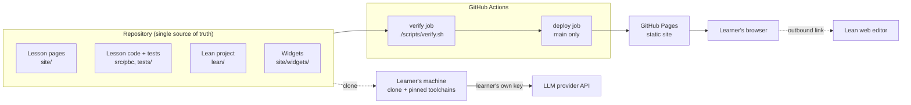
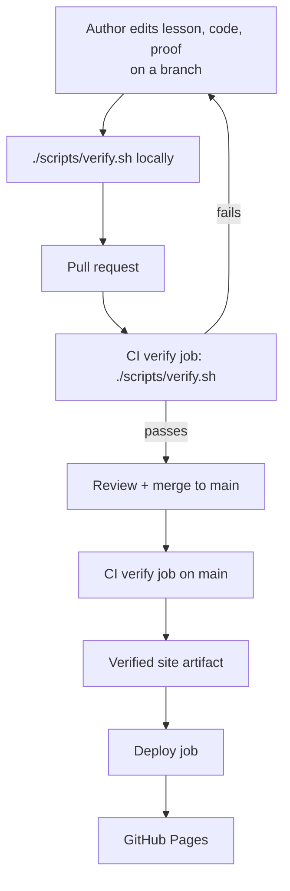

# Architecture

Physics by Construction is a static educational website whose every code
listing, figure, and proof is produced or checked by the same pipeline that
publishes it. This document describes the target architecture for the MVP and
the boundaries later phases must respect.

- Source of product scope: `docs/PROJECT_REQUIREMENTS.md` (approved
  2026-10-06). Where this document and the requirements disagree, the
  requirements win and the disagreement is a defect in this document.
- Decisions with a durable record: `docs/decisions/001` to `004`.
- Planning base commit: `502ced0`. At that commit the repository contains only
  the agentic workflow template (scripts, prompts, shell tests). Nothing
  described below is built yet; `docs/roadmap.md` orders the work.

## System context

### Users

| Role | Interaction with the system |
|---|---|
| Learner (anonymous, advanced) | Reads the published site; clones the repository to reproduce lessons, run agents with their own API key, and check proofs. |
| Maintainer/author (with AI agents) | Writes lessons, code, and proofs in the repository; merges through pull requests gated by CI. |
| Outside contributor (later phase) | Proposes content through GitHub Issues and reviewed pull requests. |

There are no signed-in or administrator roles and no server that could hold
them.

### System boundary



Inside the boundary: the repository, the verification and build pipeline, and
the published static artifact.

Outside the boundary, with the direction of dependency:

| External system | Used by | Nature |
|---|---|---|
| GitHub (repository, Issues, pull requests, Actions, Pages) | Maintainer, CI, hosting | Required. |
| Python package index | CI and local builds | Required at install time; versions and hashes come from `uv.lock`. |
| Lean toolchain releases, Mathlib, and the Mathlib build cache | CI and local builds | Required at install time; versions come from `lean/lean-toolchain` and `lean/lake-manifest.json`. |
| Quarto release binaries | CI and local builds | Required at install time; version comes from `uv.lock` (see ADR 001). |
| Playwright browser builds and, on Linux, the distribution's package repository | CI and local builds | Required during the one-time setup; the browser build is fixed by the Playwright version in `uv.lock`. |
| LLM provider API | Agent lessons, on the learner's machine only | Never contacted by the site or by CI. |
| Lean web editor (live.lean-lang.org) | Learner's browser | Outbound link only. |
| External notebook services | Learner's browser | Optional outbound links only; none are planned for the MVP. |

The published site itself depends on nothing at runtime except GitHub Pages
serving its files.

## Components

### Repository layout

Target layout. Paths marked "existing" are the workflow template and stay as
they are.

```text
site/                    Quarto project: the website source
  _quarto.yml            Site configuration (navigation, theme, math, base URL)
  index.qmd              Home page
  path/                  Learning path page (generated from lesson metadata)
  lessons/<strand>/<nn>-<slug>/index.qmd   One directory per lesson
  widgets/               Self-hosted JavaScript widgets (ES modules)
  assets/                Styles, fonts, vendored Lean syntax definition
src/pbc/                 Importable Python package with all reusable lesson code
  mechanics/             Models and integrators used by the mechanics course
  agents/                Agent harness: provider interface, tool allowlist, replay
  authoring/             Helpers lessons use to display code and proofs by reference
tests/
  unit/                  pytest: behaviour of src/pbc
  integration/           pytest: lesson metadata, lesson structure, agent replay
  e2e/                   pytest + headless browser: checks on the built site
  *.sh                   Existing shell tests of the workflow scripts
lean/                    One Lake project for all proofs
  lean-toolchain, lakefile, lake-manifest.json
  PhysicsByConstruction/<Course>/<Topic>.lean
scripts/verify.sh        Existing single verification entry point
scripts/verify.conf      Existing list of required checks; project checks are added here
scripts/*.sh, .agents/   Existing agentic development workflow
.github/workflows/ci.yml Existing CI workflow; extended with setup, caching, and deploy
docs/                    Requirements, architecture, roadmap, ADRs, authoring guide
pyproject.toml, uv.lock, .python-version   Python toolchain pins
LICENSE, LICENSE-CONTENT MIT for code, CC BY 4.0 for lesson text and figures
```

### Component responsibilities

| Component | Responsibility | Must not |
|---|---|---|
| **Lesson pages** (`site/lessons/`) | Explanation, assumptions, worked examples, exercises with solutions, the "Reproduce this" section. Display code, outputs, figures, and proofs only through the verified display forms below. | Contain hand-copied code, pasted figures, or hand-typed results. |
| **Lesson code package** (`src/pbc/`) | All reusable simulation code: models, integrators, analysis helpers. Unit-tested. The code learners import when they reproduce a lesson and the functions agents are allowed to call. | Depend on the site generator, on network access, or on an LLM provider SDK outside `pbc.agents`. |
| **Lean project** (`lean/`) | All formal proofs, built with `lake build` against pinned Lean 4 and Mathlib. | Contain `sorry`, `admit`, or project-declared `axiom`s. Claim anything about the Python code. |
| **Widgets** (`site/widgets/`) | Optional interactive visualizations that enhance a static figure already present in the page. | Load code or data from another origin, store or transmit learner data, or be required to read a lesson. |
| **Site generator** (Quarto, ADR 001) | Executes lesson pages, renders equations to MathML, highlights code at build time, emits static HTML. | Add third-party runtime resources (CDN scripts, web fonts, analytics). |
| **Content checks** (`tests/integration`, `tests/e2e`) | Enforce the invariants in this document on lesson sources and on the built site. | Depend on network access or credentials. |
| **Verification entry point** (`scripts/verify.sh`, `scripts/verify.conf`) | Run every required check with one command, identically on a laptop and in CI (ADR 003). | Have CI-only or local-only checks. |
| **CI/CD workflow** (`.github/workflows/ci.yml`) | Install pinned toolchains, restore caches, run `./scripts/verify.sh`, publish the verified artifact from `main`. | Rebuild the site in the deploy job, hold LLM keys, or grant write permissions to pull request runs. |
| **Agent harness** (`src/pbc/agents/`, ADR 004) | Run an LLM-driven experiment loop over an explicit allowlist of simulation functions, live on the learner's machine or as a deterministic replay in CI. | Execute model-generated code, shell commands, or network calls; print or log credentials. |
| **Agentic development workflow** (`scripts/`, `.agents/`, existing) | Plan, implement, review, and triage repository changes. Development tooling, not part of the product. | Be confused with the "AI agents" lesson strand. |

### Lesson model

A lesson is one directory under `site/lessons/<strand>/` whose `index.qmd`
carries validated front matter and a fixed set of sections.

Strands, in learning path order:

1. `mechanics`: mechanics with numerical simulation.
2. `agents-llm`: experiments driven by LLM agents.
3. `agents-abm`: agent-based modelling without LLMs.
4. `lean`: formal proofs.

A strand appears on the site once it has at least one published lesson.

Front matter, validated by a check (exact schema is fixed in F02):

| Field | Meaning |
|---|---|
| `id` | Stable identifier, unique across the site. Used for prerequisites and, later, for learner progress. Never reused. |
| `title` | Lesson title. |
| `strand`, `order` | Position in the learning path. |
| `difficulty` | Ordinal level on one site-wide scale (default: 1 to 3). |
| `prerequisites` | Lesson `id`s that must come earlier in the path, plus free-text outside prerequisites. |
| `lean-modules` | Lean modules this lesson displays, when any. |

Required sections, checked for presence: explanation, assumptions, worked
examples, code, exercises (with on-page solutions) or an interactive
visualization, and "Reproduce this" (exact files and commands at the built
commit).

The learning path (order, difficulty, prerequisites, previous and next links)
is derived from lesson front matter. There is no second, hand-maintained list
that could drift.

### Verified display forms

Everything a lesson shows as code, output, figure, or proof must reach the page
through one of these forms (ADR 002):

| Shown on the page | Allowed source |
|---|---|
| Python code | (a) An executable cell that the build runs, or (b) an excerpt included by reference from `src/pbc/` at build time. |
| Program output and numbers | Output of an executed cell, including values computed inline. |
| Figures | Produced by an executed cell during the build, with alt text and explicit dimensions. |
| Lean code | An excerpt included by reference from a file in `lean/` that `lake build` compiled. |
| Agent run transcripts | Produced by the replay run during the build (ADR 004). Recorded model messages come from the committed replay fixture and are labelled as recorded; tool results are the recomputed ones, never the recorded ones. |
| Interactive visualizations | Data computed by executed cells during the build and embedded in the page. Where a widget computes in the browser, a test compares its results with reference values from `src/pbc`. |
| Anything else | Must carry the explicit "not verified" marker, which renders a visible label. A check fails the build for unmarked, non-executed code. |

## Data flows

### Authoring to publication



### Inside one verification run

Order matters only where stated; every step is a required check in
`scripts/verify.conf`. A preflight check listed first reports every missing
prerequisite of the supported-machine contract (see "Toolchains and pinning")
with a fix hint, so a missing tool is not first seen as an obscure failure
inside a later check.

1. **Lint and format**: Python sources and lesson cells.
2. **Unit tests**: `pytest` on `src/pbc`.
3. **Lean build**: fetch the Mathlib cache, then `lake build` for every module
   in `lean/`. Fails on `sorry` and on project-declared axioms.
4. **Lesson source checks**: front matter schema, required sections,
   prerequisite graph (references exist, no cycles, prerequisites come
   earlier), "not verified" markers.
5. **Site build**: Quarto executes every lesson page in the locked Python
   environment and renders the static site. A failing cell, an agent replay
   mismatch, or an equation that cannot be converted to MathML fails the build.
   Depends on step 3 only in that Lean excerpts are read from the same
   sources step 3 compiled.
6. **Built-site checks**: no resource loaded from another origin; images have
   alt text and explicit dimensions; internal links resolve; pages are
   readable with JavaScript disabled; automated WCAG 2.1 A/AA scan; no cookies
   set.
7. **Determinism**: a second build of the same commit is byte-identical to the
   first.
8. **Workflow self-tests**: the existing shell tests of the workflow scripts.

### Learner reproduces a lesson

1. Clone the repository at the commit named in the lesson's "Reproduce this"
   section.
2. Complete the one-time setup of the supported-machine contract (see
   "Toolchains and pinning"): Git, uv, elan, and jq, plus the Playwright
   browser build and, on Linux, its system libraries. Only this step may need
   administrator rights. Everything else is resolved from lock files.
3. Run the commands the lesson lists. They execute the same files CI executed
   and reproduce the numbers on the page to the precision the page displays.
4. Optionally run `./scripts/verify.sh` to rebuild the whole site and all
   lesson outputs. It needs no administrator rights and reports a missing
   prerequisite with a fix hint.

### Agent lesson (learner's machine)

1. The learner sets the provider API key in a local environment variable.
2. The lesson's entry point starts the harness with the live provider client
   and the lesson's tool allowlist.
3. The model proposes tool calls. The harness validates each call against the
   allowlist and its argument bounds, runs the simulation function from
   `src/pbc`, and returns the result. Nothing else is executable.
4. The run ends at the step limit or when the model reports a conclusion. The
   transcript is written locally with credentials never included.

In CI and in the site build the same loop runs with the replay client instead
of a live provider, so tool results on the page are recomputed, not recorded
(ADR 004).

### Formal proof lesson

1. The proof lives in `lean/PhysicsByConstruction/...` and is compiled by step
   3 above.
2. The lesson page includes the proof text by reference and highlights it at
   build time.
3. The page links to the file in the repository at the built commit and to
   the Lean web editor loading that file. The repository file and the CI
   result are authoritative; the web editor is a convenience that may run a
   different Mathlib version.

### Learner state (later phase)

Progress, self-check results, and recommendations are computed in the browser
and written to browser local storage under a versioned, site-specific key.
There is no request that carries them anywhere. Not built in the MVP; the MVP
site stores no learner state at all.

## Invariants and boundaries

Agents and reviewers must preserve these. Each names how it is enforced; an
invariant whose check does not exist yet is created by the roadmap feature
shown.

| # | Invariant | Enforced by |
|---|---|---|
| I1 | The published site is static files only. No server-side code, no runtime secrets, no backend. | Hosting choice; review. |
| I2 | The site never calls an LLM, never holds API keys, and CI holds no LLM credentials. | No secrets referenced in workflows (review, F01); replay client in builds (F09). |
| I3 | No analytics, tracking, cookies, or third-party runtime resources. All scripts, styles, fonts, and images are served from the site's own origin. | Built-site check (F01). |
| I4 | All text, code, equations, and static figures are readable with JavaScript disabled. Interactives enhance a static fallback. | Built-site check with scripting disabled (F01, F07). |
| I5 | Code, outputs, figures, and proofs on the site come only through the verified display forms. Unverified material is visibly marked. | Lesson source check (F02); ADR 002. |
| I6 | Generated artifacts are never committed. Figures, outputs, and rendered pages are regenerated by every build. The one committed recording is the replay fixture of an agent lesson: a verification input at its declared location, free of credentials, whose recorded tool results are never displayed and are compared with recomputed values on every build. | Lesson source check, which exempts only declared replay fixtures, and `.gitignore` (F02); replay (F09); ADR 002, ADR 004. |
| I7 | A lesson whose code fails, whose proof does not compile, or whose page does not build cannot be merged. | Required status check on `main` (F01). |
| I8 | CI and local verification run the same checks through `./scripts/verify.sh`. | Workflow calls only that script (F01); ADR 003. |
| I9 | The deployed site is the artifact the verify job built for that `main` commit. The deploy job does not build. | Workflow structure (F01); ADR 003. |
| I10 | Toolchains are pinned: Python version and `uv.lock`; Lean toolchain and Mathlib revision; Quarto version; the browser build for the site checks, through the Playwright version in `uv.lock`; GitHub Actions by commit SHA; any JavaScript dependency by version and checksum. | Lock files; frozen installs in verification (F01). |
| I11 | Builds are deterministic: the same commit produces byte-identical output. | Determinism check (F01). |
| I12 | Lean proofs contain no `sorry`, `admit`, or project-declared `axiom`. Physical assumptions are theorem hypotheses or structure fields, so the page shows them. | Lean build check (F01, F08). |
| I13 | Lean proofs are about physics models. Nothing on the site claims the Python code is formally verified. | Review; authoring guide (F08). |
| I14 | Agents can call only allowlisted simulation functions with validated arguments. No shell, file, or network capability by default. Credentials come only from environment variables and are never printed or logged. | Harness design and tests (F09); ADR 004. |
| I15 | Pull requests from forks get a read-only token and no secrets. Workflows use `pull_request`, never `pull_request_target`. | Workflow review (F01). |
| I16 | Learner state, once it exists, stays in browser local storage and is never transmitted. | Built-site check for network requests (F13). |
| I17 | Site URLs are relative or derived from one configured base URL, so a later custom domain needs one configuration change. | Internal link check on a sub-path build (F01). |
| I18 | Every lesson states its assumptions, has complete metadata, and has the required sections. | Lesson source check (F02). |
| I19 | English only. Code under MIT, lesson text and figures under CC BY 4.0, third-party material attributed. | Licence files (F01); review. |

Boundaries for agents working in this repository, in addition to `AGENTS.md`:

- Do not add a runtime dependency on any external service to the site.
- Do not introduce a JavaScript build toolchain, a second site generator, or
  committed generated outputs without a new ADR. Replay fixtures as defined in
  ADR 002 are the only committed recordings.
- Do not weaken or skip a check in `scripts/verify.conf` to make a lesson
  pass. Fix the lesson or mark the material "not verified".
- Do not change repository settings, Pages configuration, or workflow
  permissions without explicit human approval.

## Runtime and deployment

### Runtime

There is no application runtime. The only executing code is:

- at build time, in CI or locally: Python lesson code, the Lean compiler, and
  Quarto;
- in the learner's browser: optional self-hosted widgets;
- on the learner's machine, by their own choice: lesson code, proofs, and
  agents.

### Toolchains and pinning

| Toolchain | Pin | Installed by |
|---|---|---|
| Python | `.python-version`, `pyproject.toml`, `uv.lock` | `uv` (frozen sync) |
| Python packages | NumPy, SciPy, Matplotlib (lesson code); pytest, Ruff (quality); Jupyter kernel (execution); Playwright with an axe-core binding (built-site checks). LLM provider SDK only as an optional extra (F09). | `uv` |
| Quarto | `quarto-cli` version in `uv.lock`; the package fetches the matching Quarto release | `uv` |
| Lean 4 | `lean/lean-toolchain` | `elan` |
| Mathlib | Tagged revision in the lakefile, resolved in `lean/lake-manifest.json` | `lake`, with the Mathlib cache |
| Browser for the built-site checks | Browser build fixed by the Playwright version in `uv.lock` | Playwright's installer, during the one-time setup |
| Browser system libraries (Linux only) | Not pinned; provided by the distribution | Playwright's dependency installer or the system package manager, during the one-time setup |
| jq | Not pinned; any current release | System package manager, during the one-time setup |
| GitHub Actions | Full commit SHA per action | Dependabot proposes updates |
| JavaScript | No package manager in the MVP. Widgets are dependency-free ES modules. A third-party library, if ever needed, is vendored with version, licence, and checksum. | None |

Exact versions are chosen when F01 is implemented: the newest stable releases
that are mutually compatible at that time. Upgrades are ordinary pull requests
that must pass verification. Python and Actions updates are proposed by
Dependabot; Lean and Mathlib are bumped together by hand because Dependabot
does not cover Lake.

**Supported-machine contract.** A supported machine runs macOS or Linux and
has completed a one-time setup that provides:

- Git, uv, and elan;
- jq, which the workflow self-tests kept in `verify.conf` call directly
  (ADR 003);
- the Playwright browser build used by the built-site checks;
- on Linux, the system libraries that browser needs. Playwright's dependency
  installer covers the distributions it supports, including the Ubuntu CI
  runner; on other distributions the libraries are installed by hand.

Setup and verification are separate steps:

- **Setup** is documented in `docs/development.md` (F01), runs once per
  machine, and is the only step that may need administrator rights (system
  packages for jq and for the Linux browser libraries). The browser build
  itself is downloaded into the user's cache without elevated rights.
- **Verification** is `./scripts/verify.sh`, the single documented command
  that reproduces the whole site and all lesson outputs. It never needs
  administrator rights and never installs system packages. Everything it
  fetches (Python packages, Quarto, the Lean toolchain, Mathlib and its
  cache) is resolved from lock files into user-writable locations.

A missing prerequisite is reported with a fix hint by `./scripts/doctor.sh`
and by the preflight check at the start of verification, which also confirms
that the pinned browser build is installed and starts. The preflight checks
only what verification needs; `doctor.sh` additionally checks the tools of the
agentic development workflow (GitHub CLI, agent CLIs), which verification does
not need.

### Environments

| Environment | What it is | Notes |
|---|---|---|
| Local | A clone on macOS or Linux after the one-time setup of the supported-machine contract | Same checks as CI. Verification itself is unprivileged. |
| CI | GitHub-hosted Ubuntu runner, prepared with the same setup | Reference platform for the numbers and figures shown on the site. |
| Production | GitHub Pages, `github-pages` environment | Built only from `main`. Default URL `https://taspinar.github.io/physics-by-construction/` until a custom domain is decided. The repository is already public; Pages is not enabled yet (F01). |

There is no staging environment. The site artifact of every pull request run
is attached to the workflow run for review before merge.

### CI pipeline and time budget

One workflow, triggered by `pull_request` and by `push` to `main`:

- **verify job** (always): check out, restore caches (uv, Lean toolchain,
  `.lake` including Mathlib build products, browser for the site checks),
  provide the prerequisites of the supported-machine contract with the same
  setup a local machine uses (uv, elan, jq, the Playwright browser build and
  its Linux system libraries), fetch the Mathlib cache, run
  `./scripts/verify.sh`, upload the site artifact. Workflow-level
  permissions: `contents: read`.
- **deploy job** (only `push` to `main`, after verify succeeds): publish the
  uploaded artifact with the GitHub Pages actions. Permissions: `pages: write`
  and `id-token: write` only. No long-lived credentials.

`verify` is the one required status check in the `main` ruleset. No path
filters: every pull request runs every check, so a required check is never
skipped.

Budget (required by the requirements; rationale in ADR 003):

| Measure | Budget |
|---|---|
| Typical pull request, warm caches, wall clock | 12 minutes or less |
| Cold caches (for example after a Mathlib bump) | 25 minutes or less |
| Job timeout | 30 minutes |
| Unit tests | 2 minutes or less |
| Lean build after the Mathlib cache is in place | 3 minutes or less |
| One lesson page, executed | 30 seconds or less |
| One full site build | 3 minutes or less |

Mathlib is never compiled from source in CI; if its cache cannot be fetched
the job fails.

If the typical run exceeds its budget, the responses follow the order ADR 003
fixes:

1. Reduce the cost of the offending lesson or check.
2. Only if that is not enough, split the verify job into parallel jobs that
   each run a named subset of the same `verify.conf` checks, behind one
   aggregate required check, so the merge gate stays a single, always-present
   status check and no check is declared only in workflow YAML.

Dropping a check, adding path filters, or moving a check to a schedule is not
available as a response; each would need a new ADR.

### Deployment and recovery

- Deployment is automatic for every verified commit on `main`.
- Recovery from a bad deployment is a revert pull request, which verifies and
  redeploys. Re-running the deploy job of an earlier successful run is the
  faster fallback.
- Availability is whatever GitHub Pages provides. No SLA, no on-call, no
  monitoring beyond the workflow status.

### Persistence

| Data | Where | Retention |
|---|---|---|
| Lessons, code, tests, proofs, configuration | Git repository | Git history. |
| Figures, outputs, rendered site | Build output only, never committed | Replaced by each build. |
| Agent replay fixtures (recorded model messages and the expected tool results, no credentials) | Git repository, at the declared fixture location in the lesson directory (ADR 002) | Git history. Verification inputs: re-recorded when the replay fails. |
| Published site | GitHub Pages artifact | Replaced by each deployment. |
| Learner state (later phase) | Learner's browser local storage | Until the learner clears it. No recovery. |

Nothing else is stored anywhere.

### Security and privacy

- **Secrets**: none in the repository, the workflows, or the site.
  `.env.example` lists variable names only. Secret scanning and push
  protection stay enabled.
- **Workflow permissions**: read-only by default, write scopes only in the
  deploy job, actions pinned by SHA, fork pull requests unprivileged.
- **Supply chain**: lock files for Python and Lean, frozen installs,
  Dependabot alerts and updates, self-hosted site assets.
- **Agent safety**: allowlisted tools with bounded arguments and a step limit;
  the model's text is data, never code to run; lessons state exactly what the
  agent may do.
- **Privacy**: the site collects, stores, and transmits no personal data and
  sets no cookies.
- **Content integrity**: I5 and I7 make "shown on the site" mean "verified by
  CI" unless visibly marked otherwise.

## Requirements coverage of open choices

Choices the requirements left to planning, and where they are settled:

| Open choice in the requirements | Decision | Record |
|---|---|---|
| Site technology | Quarto, build-time execution, MathML equations | ADR 001 |
| Generated artifacts: regenerate or commit | Regenerate on every build, never commit. Agent replay fixtures are committed verification inputs, checked against recomputed values on every build | ADR 002, ADR 004 |
| CI time budget | 12 minutes typical, 30 minute timeout | This document; ADR 003 |
| Python packages | NumPy, SciPy, Matplotlib, pytest, Ruff | Toolchains table |
| Exact mechanics lesson list | Eight lessons | `docs/roadmap.md` |
| Agent-based-modelling lesson in the MVP or after (unresolved question 4) | First follow-up after the MVP | `docs/roadmap.md`, F11 |
| How agent lessons are verified without credentials in CI | Deterministic replay | ADR 004 |

Unresolved questions that stay open, with the feature that must settle them:

| Unresolved question | Settled when | Effect on the architecture |
|---|---|---|
| 1. Default LLM provider | F09 planning, by the human | None: the provider sits behind the client interface (ADR 004). |
| 2. LLM credentials in CI for the content workflow | F12 planning, by the human | Until then I2 holds without exception. |
| 3. Custom domain | F10, by the human, before public launch | None beyond I17. |

## Assumptions and risks

- **"Identical results" means identical at displayed precision.** Floating
  point results can differ in the last bits between macOS and Linux and
  between linear algebra backends. Lessons display rounded values, tests use
  explicit tolerances, and the CI runner is the reference platform. Byte-level
  determinism (I11) is required on one platform, not across platforms. If the
  human expects bit-identical numbers across platforms, that is a requirements
  question for Project Grill.
- **MathML rendering quality.** Pandoc converts a large subset of LaTeX to
  MathML, not all of it. Lessons stay inside that subset and the build fails
  on an unconvertible equation. A self-hosted math font is needed for
  consistent rendering.
- **Lean highlighting.** Pandoc ships no Lean syntax definition, so the site
  vendors one (F08). Highlighting is build-time token colouring only; there is
  no hover or type information.
- **Mathlib cache and CI caches.** The Mathlib cache is a community service
  and Mathlib build products are several gigabytes against GitHub's cache
  quota. Cache eviction makes runs slower, not wrong. Measured in F01.
- **Quarto determinism.** Some Quarto outputs can embed build-time values such
  as sitemap dates. F01 must configure or normalise them to satisfy I11.
- **Quarto binary download.** `quarto-cli` pins the version but downloads the
  release binary at install time. If this proves unreliable, F01 may switch to
  a checksum-pinned release download without changing the architecture.
- **Lean web editor version drift.** The public editor runs its own Mathlib
  version, so a proof that compiles in CI may fail there after Mathlib moves.
  The link is labelled accordingly (F08).
- **Automated accessibility checks cover only part of WCAG 2.1 AA.** A manual
  audit is part of the release gate (F10).

## Repository state compared with the requirements

No material conflict was found between the approved requirements, the
repository, and `docs/repository-setup.md`. The following template leftovers
do not match the requirements yet and are resolved by F01:

- `.github/workflows/ci.yml` pins `actions/checkout` by tag and declares no
  `permissions`.
- `README.md`, `CONTRIBUTING.md`, `.github/CODEOWNERS`, `.env.example`,
  `docs/deployment.md`, and `docs/operations.md` still hold template text or
  placeholders.
- No licence files exist.
- `docs/repository-setup.md` sections on GCP, staging, and production
  databases do not apply to this project.
