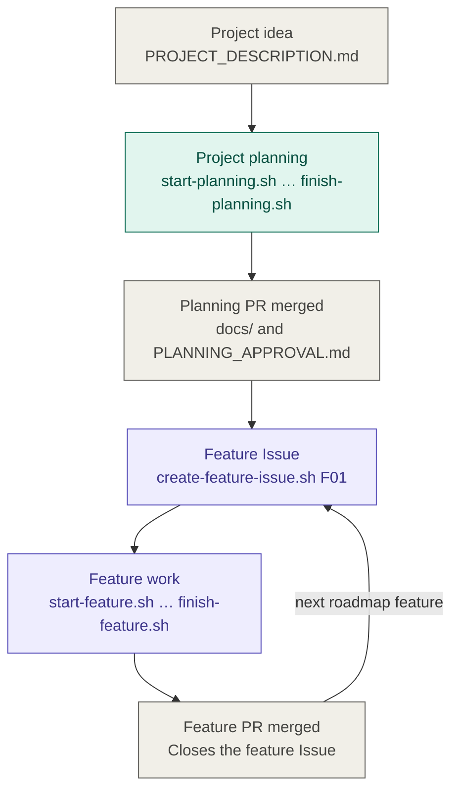
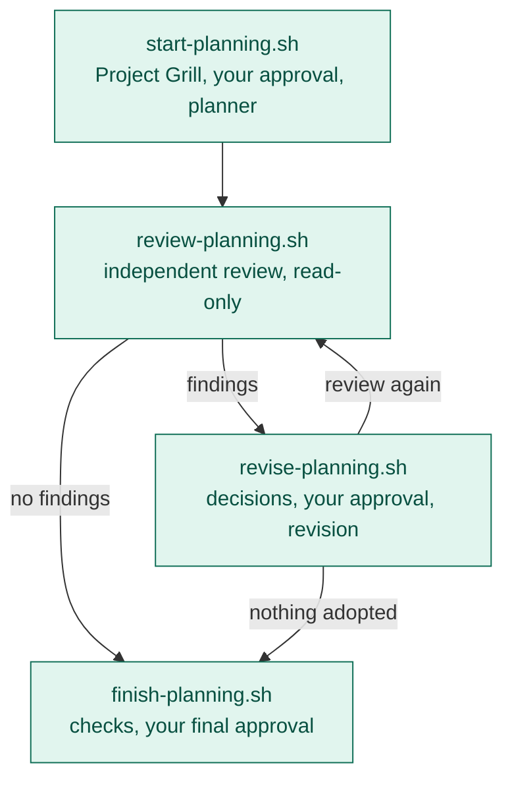
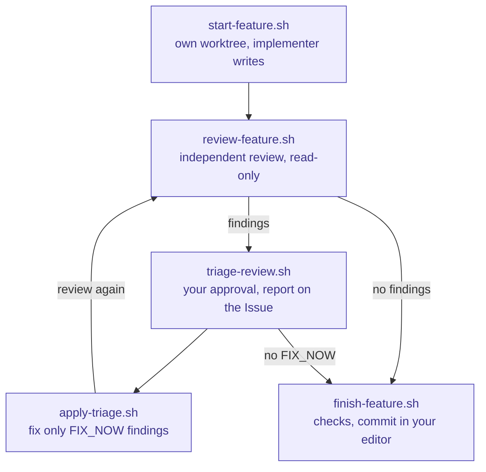
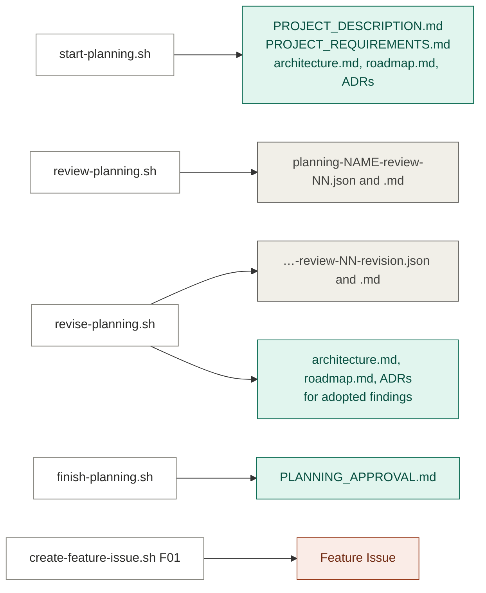
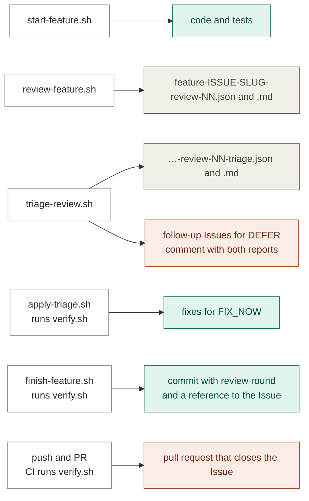

# Workflow

How a project goes from an idea to merged features, in three views:

1. [Flow](#flow): the steps and the loops between them.
2. [Artifacts](#artifacts): what each step produces and where it lives.
3. [Reference](#reference): per step, who acts, where you approve, and what is
   written and committed.

The commands and their options are described in `docs/development.md`. A
complete run with a sample project is in `docs/example.md`. What each file in
the repository is for is in `docs/project-map.md`.

## Flow

### Overview

The project planning happens once. Every roadmap feature then goes through its
own Issue, feature work, and pull request.

### Planning phase

All planning steps run in the planning worktree (`planning/<name>`).

- A revision that adopts findings changes the planning documents, so the
  review becomes stale and the next step is a new review round.
- When the planner rejects or defers every finding, nothing changes and you
  can finish directly.
- A finding that the planner escalates needs your decision: either it does not
  apply, or the approved requirements must change. There is no script yet that
  runs Project Grill again in an existing planning worktree, and
  `start-planning.sh` always starts a fresh planning branch. To change the
  requirements, edit `docs/PROJECT_REQUIREMENTS.md` in the planning worktree,
  or start a Project Grill session there by hand with
  `.agents/prompts/project-grill.md`, and run a new review round. The planning
  review covers the requirements, and `finish-planning.sh` records your
  approval of exactly the reviewed documents. It refuses while an escalation
  of the latest round is unresolved and asks you to confirm earlier ones.

### Feature phase

All feature steps run in the feature worktree (`feature/<issue>-<slug>`).

- Fixes change the code, so the review becomes stale and the next step is a new
  review round. A passed newer round confirms the fixes of earlier rounds.
- When the triage has no `FIX_NOW` findings, only deferred and accepted ones,
  you can finish directly.
- After `finish-feature.sh`, push the branch, open a pull request containing
  `Closes #<issue>`, and merge it after CI. Then remove the worktree and its
  branch with `cleanup-worktree.sh <issue>`.

## Artifacts

Every step writes to one of three places:

- **Repository**: committed with the planning or feature pull request.
- **Working file**: under `.agents/reviews/` or `.agents/triage/`, read by the
  scripts and ignored by Git.
- **GitHub**: Issues, comments, and pull requests.

### Planning phase

Green is committed, grey is a working file, orange is on GitHub. Because
review and revision files are not committed, `PLANNING_APPROVAL.md` records
the review rounds and every finding that was not adopted; use it for the
planning PR description.

### Feature phase

Code, tests, and fixes stay uncommitted until `finish-feature.sh`, so every
review covers the complete change. The lasting record of each review round is
the comment on the feature Issue and the follow-up Issues, each of which names
its source finding.

## Reference

Agent roles and models come from `.agents/agents.conf`; every agent script
accepts `--agent` and `--model` to override them for one run. Profiles are
described in `docs/development.md`: `write` sessions may change files in their
worktree, `read-only` sessions cannot and get no MCP servers or other remote
tools.

### Steps

| Step | Agent: role (profile) | Your decision | Writes | Committed | `verify.sh` |
|---|---|---|---|---|---|
| `start-planning.sh` | `project-grill` (write), then `project-planner` (write) | Approve the requirements | Description, requirements, architecture, roadmap, ADRs | Yes, with the planning PR | No |
| `review-planning.sh` | `planning-reviewer` (read-only) | None | Planning review JSON and report | No | No |
| `revise-planning.sh` | `project-planner` (read-only, then write) | Approve the decisions | Revision JSON and report; architecture, roadmap, ADRs | Documents yes, revision no | No |
| `finish-planning.sh` | None | Confirm earlier escalations; approve the planning | `docs/PLANNING_APPROVAL.md` | Yes | No |
| `create-feature-issue.sh` | None | Create the Issue | Feature Issue on GitHub | Not applicable | No |
| `start-feature.sh` | `implementer` (write) | None | Code and tests | Yes, by `finish-feature.sh` | No |
| `review-feature.sh` | `reviewer` (read-only) | None | Review JSON and report | No | No |
| `triage-review.sh` | `triage` (read-only) | Approve the triage | Triage JSON and report; follow-up Issues and a comment on GitHub | No | No |
| `apply-triage.sh` | `triage-implementer` (write) | Start the fixes | Fixes for `FIX_NOW` findings | Yes, by `finish-feature.sh` | Yes |
| `finish-feature.sh` | None | Edit and confirm the commit message | The commit | Yes | Yes |
| Push and PR | None | Merge after CI | Pull request | Not applicable | Yes, in CI |

### Checks that stop a step

| Step | Refuses when |
|---|---|
| `start-planning.sh` | The checkout is dirty (except an uncommitted description), the planning branch or worktree exists, or an agent leaves its file scope or commits |
| `review-planning.sh` | Not on a planning branch, a planning document is missing, or the requirements are not approved |
| `revise-planning.sh` | The planning review is stale, or the planner leaves its file scope, commits, or changes nothing for adopted findings |
| `finish-planning.sh` | No current review, a critical or major finding in the latest round, an undecided or unapplied finding, or an unresolved escalation |
| `create-feature-issue.sh` | The planning approval is missing or stale, the feature ID is unknown, duplicated, or empty, or the feature already has an Issue |
| `review-feature.sh` | Not on `feature/<issue>-*`, or nothing to review |
| `triage-review.sh` | The review is stale or invalid, or it is a planning review |
| `apply-triage.sh` | The triage is unapproved, invalid, or does not match its review, or the review is stale |
| `finish-feature.sh` | Verification fails, the latest review is stale or has a critical or major finding, a round with findings has no published triage, or `FIX_NOW` findings are left |

### Helper scripts

| Script | When to use it |
|---|---|
| `doctor.sh` | Once after creating a repository from the template, and whenever a tool may be missing |
| `verify.sh` | Any time; runs the checks in `scripts/verify.conf`, and is run by `apply-triage.sh`, `finish-feature.sh`, and CI. The workflow self-tests run only when a workflow file changed; `verify.sh --all`, which CI uses, always runs them |
| `check-review.sh <review-json>` | To see whether a review still matches the content it covers |
| `finish-planning.sh --check` | To see whether the planning approval still matches the planning documents |
| `triage-review.sh --publish <triage-json>` | To repeat a failed publication of the review and triage reports |
| `update-issue-with-plan.sh <issue> <plan>` | To link an optional feature plan in `.agents/plans/` to its Issue |
| `cleanup-worktree.sh <issue>`, `planning/<name>`, or `--merged` | After a merge, from the primary checkout: removes the worktree and its branch once GitHub reports the pull request as merged, and updates `main` |
