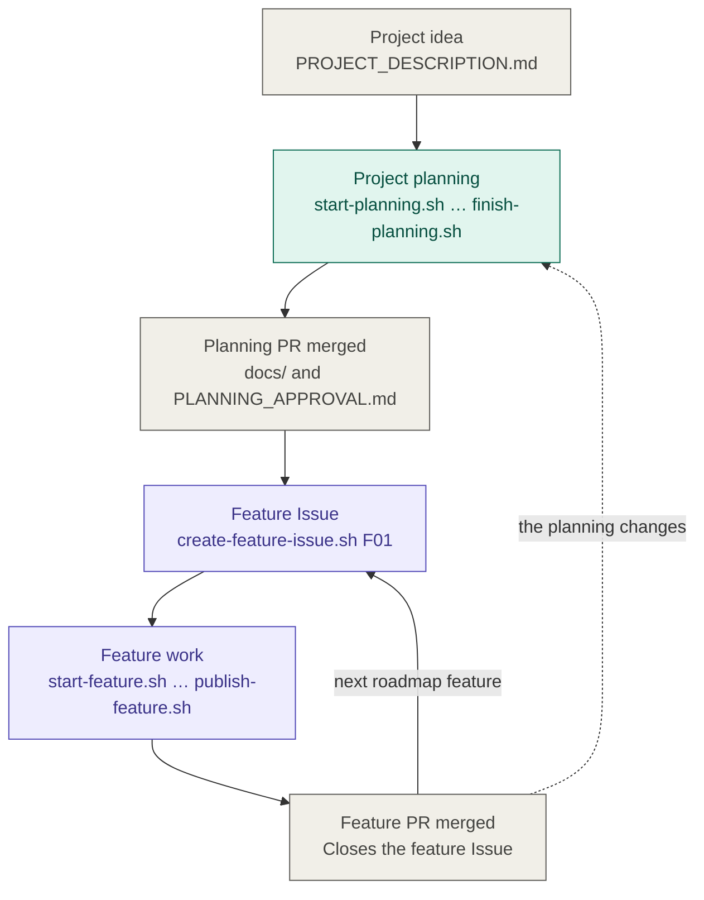
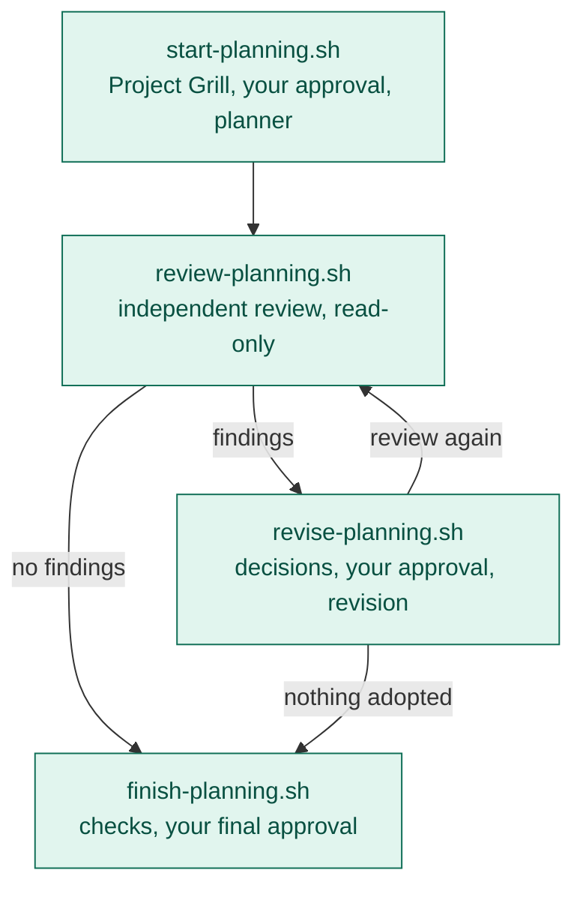
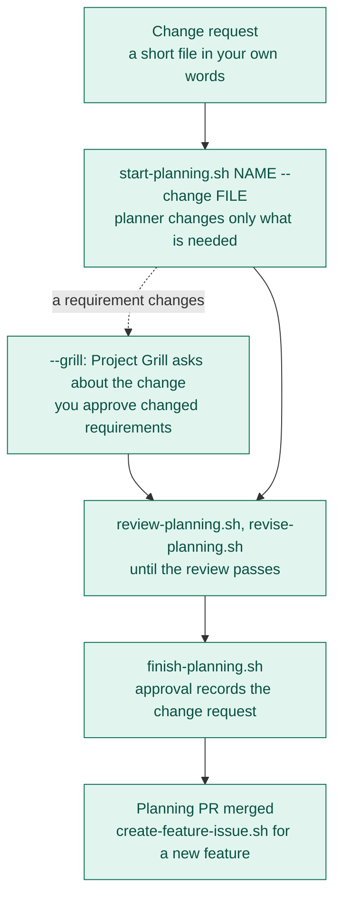
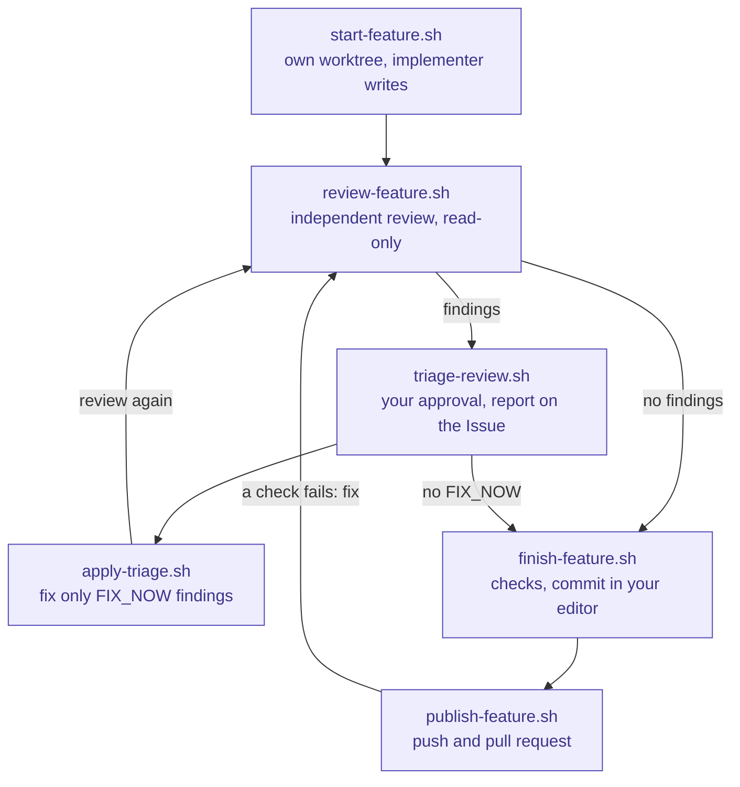
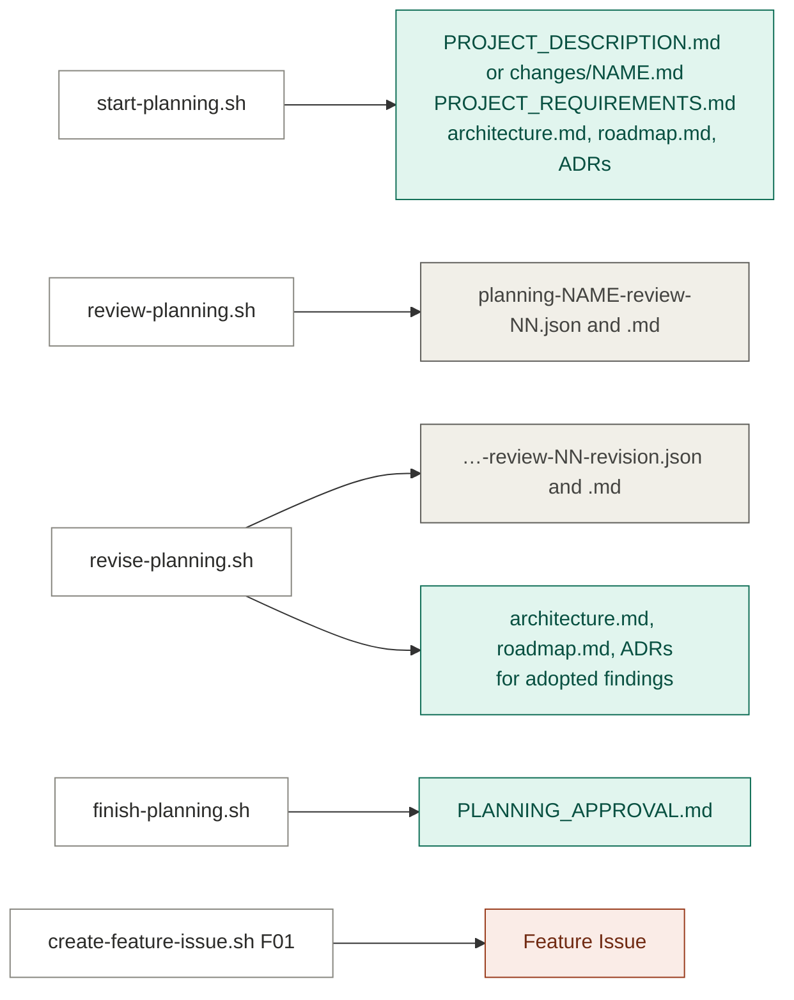
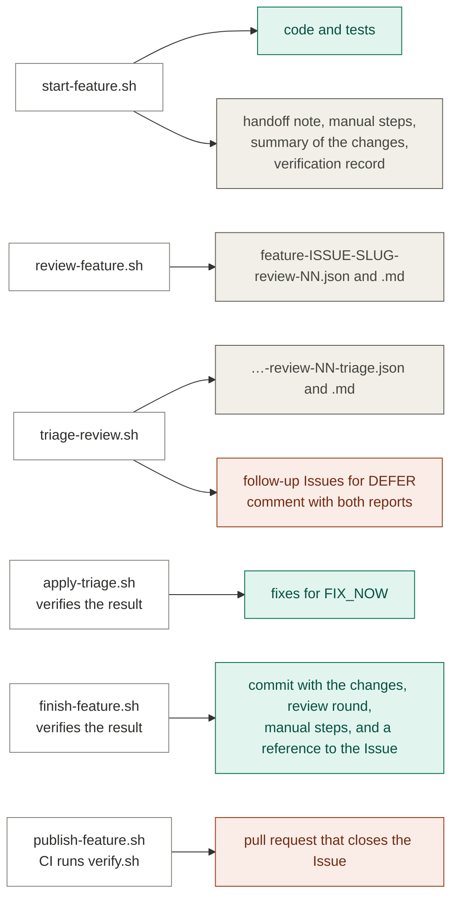

# Workflow

How a project goes from an idea to merged features, in three views:

1. [Flow](#flow): the steps and the loops between them.
2. [Artifacts](#artifacts): what each step produces and where it lives.
3. [Reference](#reference): per step, who acts, where you approve, and what is
   written and committed.

The commands and their options are described in `docs/development.md`. A
complete run with a sample project is in `docs/example.md`. What each file in
the repository is for is in `docs/project-map.md`.

## Flow

### Overview

The project planning happens once. Every roadmap feature then goes through its
own Issue, feature work, and pull request. A later change to the planning goes
through a change cycle, described under "Changing an approved planning".

### Planning phase

All planning steps run in the planning worktree (`planning/<name>`).

- A revision that adopts findings changes the planning documents, so the
  review becomes stale and the next step is a new review round.
- When the planner rejects or defers every finding, nothing changes and you
  can finish directly.
- A finding that the planner escalates needs your decision: either it does not
  apply, or the approved requirements must change. There is no script yet that
  runs Project Grill again in an existing planning worktree, and
  `start-planning.sh` always starts a fresh planning branch. To change the
  requirements, edit `docs/PROJECT_REQUIREMENTS.md` in the planning worktree,
  or start a Project Grill session there by hand with
  `.agents/prompts/project-grill.md`, and run a new review round. The planning
  review covers the requirements, and `finish-planning.sh` records your
  approval of exactly the reviewed documents. It refuses while an escalation
  of the latest round is unresolved and asks you to confirm earlier ones.

### Changing an approved planning

A planning that is approved and merged changes through a change cycle: the
same loop as above, started from a change request instead of a project idea.

| Kind of change | What changes | Project Grill |
|---|---|---|
| Fits a feature that is not built yet | Only the feature Issue | No change cycle |
| New feature within the approved requirements | Roadmap | No |
| New or changed requirement | Requirements, and usually architecture, roadmap, and ADRs | Yes: `--grill`, about the change only |
| Technical change only | Architecture and an ADR that supersedes the old one | No |
| Small technical amendment | Architecture and ADRs only | No change cycle: `finish-planning.sh --amend`, your approval without a review |

- The change request is kept as `docs/changes/<name>.md`; the original
  description is not touched.
- Feature IDs stay stable, a feature that has an Issue is not rewritten, and
  an ADR is superseded by a new one instead of removed. The script refuses a
  removed feature ID and a deleted ADR; the reviewer checks the rest.
- Between the change and its merged approval no new feature Issue can be
  created. Features in progress continue.

### Feature phase

All feature steps run in the feature worktree (`feature/<issue>-<slug>`).

- Fixes change the code, so the review becomes stale and the next step is a new
  review round. A passed newer round confirms the fixes of earlier rounds. A
  round reviews the complete feature; after a small fix,
  `review-feature.sh <issue> --changes` reviews only what changed since the
  previous round.
- When the triage has no `FIX_NOW` findings, only deferred and accepted ones,
  you can finish directly.
- `publish-feature.sh` pushes the branch and opens the pull request that
  closes the Issue. Follow its checks on the pull request and merge it
  yourself, after they passed. When `main` requires a passing check, GitHub
  enforces that; otherwise the script warns that nothing does. A failed check
  means a fix in the worktree and another round: review, finish, publish.
- After the merge, remove the worktree and its branch with
  `cleanup-worktree.sh <issue>`.
- `run-feature.sh <issue>` runs all of these steps except the merge and the
  cleanup with one command and without questions: the agents run unattended,
  the triage is approved without you, and at most five review rounds are
  used. It stops, and says how to continue, when a step fails or an agent
  needs your decision. `docs/development.md` describes what you hand over
  with it.

## Artifacts

Every step writes to one of three places:

- **Repository**: committed with the planning or feature pull request.
- **Working file**: under `.agents/`, read by the scripts and ignored by Git:
  reviews, triage, the handoff note and the manual steps of a feature, and the
  record of the last passed verification.
- **GitHub**: Issues, comments, and pull requests.

### Planning phase

Green is committed, grey is a working file, orange is on GitHub. Because
review and revision files are not committed, `PLANNING_APPROVAL.md` records
the review rounds and every finding that was not adopted; use it for the
planning PR description.

### Feature phase

Code, tests, and fixes stay uncommitted until `finish-feature.sh`, so every
review covers the complete change. A step that verifies the result reuses a
pass that was recorded for exactly that content, also one from the agent's own
run, instead of running every check again. The lasting record of each review round is
the comment on the feature Issue and the follow-up Issues, each of which names
its source finding.

## Reference

Agent roles and models come from `.agents/agents.conf`; every agent script
accepts `--agent` and `--model` to override them for one run. Profiles are
described in `docs/development.md`: `write` sessions may change files in their
worktree, `read-only` sessions cannot and get no MCP servers or other remote
tools. A third profile, `unattended`, has the reach of `write` without a
terminal and without those tools. A feature step uses it when it is run with
`--unattended`, which also answers the step's own question: the triage is
approved, the fixes start, and the commit message is not opened in an editor.
A session that needs your decision ends with a `BLOCKED:` line, and the step
exits with status 3.

### Steps

| Step | Agent: role (profile) | Your decision | Writes | Committed | `verify.sh` |
|---|---|---|---|---|---|
| `start-planning.sh` | `project-grill` (write), then `project-planner` (write) | Approve the requirements | Description, requirements, architecture, roadmap, ADRs | Yes, with the planning PR | No |
| `start-planning.sh <name> --change <file>` | `project-planner` (write); with `--grill` first `project-grill` (write) | Approve changed requirements, with `--grill` | The change request; the roadmap, architecture, or ADRs; with `--grill` the requirements | Yes, with the planning PR | No |
| `review-planning.sh` | `planning-reviewer` (read-only) | None | Planning review JSON and report | No | No |
| `revise-planning.sh` | `project-planner` (read-only, then write) | Approve the decisions | Revision JSON and report; architecture, roadmap, ADRs | Documents yes, revision no | No |
| `finish-planning.sh` | None | Confirm earlier escalations; approve the planning | `docs/PLANNING_APPROVAL.md` | Yes | No |
| `create-feature-issue.sh` | None | Create the Issue | Feature Issue on GitHub | Not applicable | No |
| `start-feature.sh` | `implementer` (write) | None | Code and tests; the handoff note, manual steps, and summary of the changes as working files | Code and tests, by `finish-feature.sh` | By the agent, after its last change |
| `review-feature.sh` | `reviewer` (read-only) | None | Review JSON and report | No | Yes, unless it already passed for this content |
| `triage-review.sh` | `triage` (read-only) | Approve the triage | Triage JSON and report; follow-up Issues and a comment on GitHub | No | No |
| `apply-triage.sh` | `triage-implementer` (write) | Start the fixes | Fixes for `FIX_NOW` findings | Yes, by `finish-feature.sh` | Yes, unless it already passed for this content |
| `finish-feature.sh` | None | Edit and confirm the commit message | The commit | Yes | Yes, unless it already passed for this content |
| `publish-feature.sh` | None | Merge after the checks passed, which you follow on the pull request | The pushed branch and the pull request | Not applicable | Yes, in CI |

### Checks that stop a step

| Step | Refuses when |
|---|---|
| `start-planning.sh` | The checkout is dirty (except an uncommitted description or change request), the planning branch or worktree exists, or an agent leaves its file scope or commits |
| `start-planning.sh --change` | Also: `origin/main` has no approved planning, the change request name is taken, the planner changed nothing, removed or renumbered a feature ID, or deleted an ADR |
| `review-planning.sh` | Not on a planning branch, a planning document is missing, or the requirements are not approved |
| `revise-planning.sh` | The planning review is stale, or the planner leaves its file scope, commits, or changes nothing for adopted findings |
| `finish-planning.sh` | No current review, a critical or major finding in the latest round, an undecided or unapplied finding, or an unresolved escalation |
| `finish-planning.sh --amend` | Anything but the architecture and the ADRs changed, an ADR was deleted, the planning on `main` has no current approval, the branch lacks the latest `main`, or a required planning document is missing |
| `create-feature-issue.sh` | The planning approval is missing or stale, the feature ID is unknown, duplicated, or empty, or the feature already has an Issue |
| `start-feature.sh` | Tracked files in the checkout are modified, or the feature branch or worktree exists. With `--resume`: no worktree, or more than one, is on a branch of the Issue |
| `review-feature.sh` | Not on `feature/<issue>-*`, nothing to review, or verification fails (unless `--unverified "<reason>"` is given) |
| `review-feature.sh --changes` | Also: there is no previous round, nothing changed since it, the base of the branch changed, or the content of the previous round is no longer known |
| `triage-review.sh` | The review is stale or invalid, or it is a planning review |
| `apply-triage.sh` | The triage is unapproved, invalid, or does not match its review, or the review is stale |
| `finish-feature.sh` | Verification fails, the latest review is stale or has a critical or major finding, a round with findings has no published triage, `FIX_NOW` findings are left, or a latest review of changes only does not build on the round before it |
| `publish-feature.sh` | There are uncommitted changes or the branch belongs to another Issue. With `--wait` it exits non-zero when a check fails |
| `run-feature.sh` | A step fails or is refused as described above, an agent needs your decision (status 3), five review rounds are used while a finding must still be fixed, or the fixes changed nothing |

### Helper scripts

| Script | When to use it |
|---|---|
| `doctor.sh` | Once after creating a repository from the template, and whenever a tool may be missing |
| `verify.sh` | Any time; runs the checks in `scripts/verify.conf`, and is run by `review-feature.sh`, `apply-triage.sh`, `finish-feature.sh`, and CI. A pass is recorded for the content it verified, and `verify.sh --reuse` skips a second run on identical content. The workflow self-tests run only when a workflow file changed; `verify.sh --all`, which CI uses, always runs them |
| `check-review.sh <review-json>` | To see whether a review still matches the content it covers |
| `finish-planning.sh --check` | To see whether the planning approval still matches the planning documents |
| `finish-planning.sh --amend "<reason>"` | To approve a change to the architecture and the ADRs only, on a `planning/<name>` branch, without a review round. Refuses any other planning change and a planning without a current approval |
| `triage-review.sh --publish <triage-json>` | To repeat a failed publication of the review and triage reports |
| `start-feature.sh <issue> --resume` | To continue a feature whose session ended early: a new implementer session in the existing worktree, which reads the handoff note and the state of the worktree |
| `sync-template.sh` | To take over changes of the workflow template: replaces unchanged files, merges changed ones, reports conflicts, and records the template version |
| `update-issue-with-plan.sh <issue> <plan>` | To link an optional feature plan in `.agents/plans/` to its Issue |
| `cleanup-worktree.sh <issue>`, `planning/<name>`, or `--merged` | After a merge, from the primary checkout: removes the worktree and its branch once GitHub reports the pull request as merged, and updates `main` |
